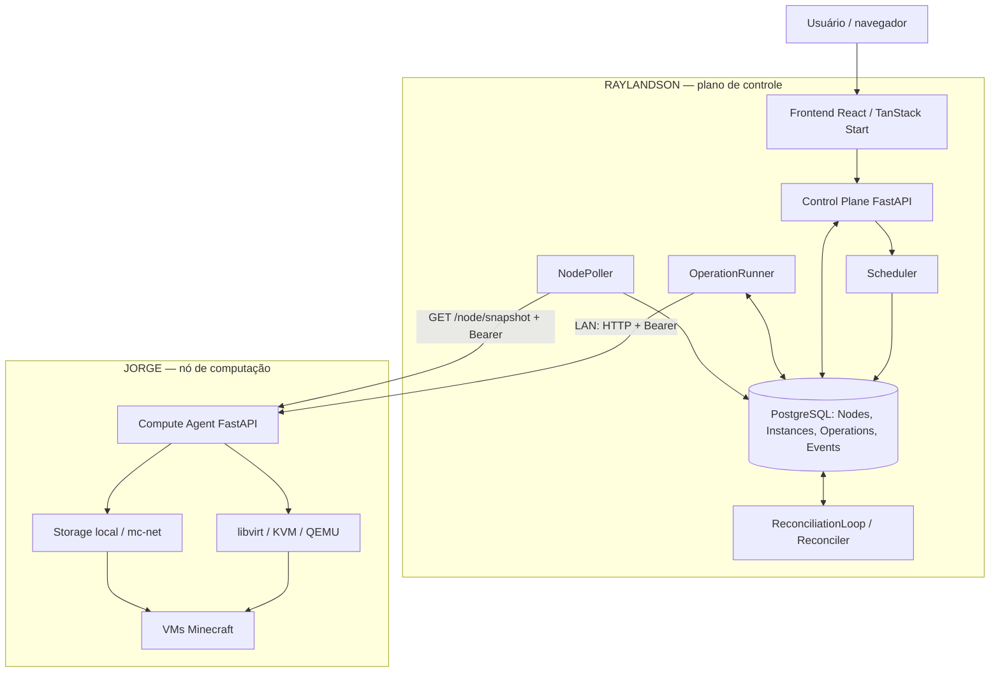
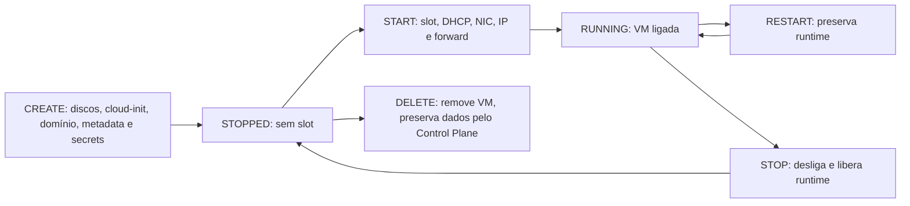

# MC-IaaS

Infraestrutura como Serviço (**IaaS**, *Infrastructure as a Service*) acadêmica para provisionar e gerenciar servidores Minecraft em máquinas virtuais, com controle distribuído, dados persistentes e observabilidade real.

## Visão geral

O MC-IaaS transforma uma solicitação no navegador em uma máquina virtual (VM) com CPU, memória, discos e rede próprios. Minecraft é a carga de trabalho escolhida para demonstrar a infraestrutura: o foco da disciplina de **Sistemas Distribuídos** é provisionar, coordenar, observar e recuperar recursos em máquinas distintas.

O sistema possui frontend, Control Plane, PostgreSQL e Compute Agent implementados. O Control Plane coordena as solicitações; o Agent executa as mudanças no host que hospeda as VMs. A implantação em dois hosts, RAYLANDSON e JORGE, foi validada pela equipe com conexão de um cliente a um servidor Minecraft real.

Este README descreve o comportamento do código versionado. Os dados de implantação e a validação física são o registro fornecido pela equipe; as configurações locais de firewall e systemd não estão versionadas aqui.

## Motivação

Iniciar processos Minecraft isoladamente não resolve todo o gerenciamento de uma infraestrutura. É preciso atribuir recursos, evitar colisões de rede, preservar mundos, acompanhar operações demoradas e lidar com componentes que podem falhar separadamente.

O projeto aplica virtualização para isolamento e limites de recursos; separa discos de sistema e dados para persistência; coordena a disputa por slots; registra a intenção antes de executar comandos remotos; e compara essa intenção com observações posteriores. Assim, criar, iniciar, reiniciar, parar e excluir tornam-se operações gerenciadas, com estado e consequências verificáveis.

## Arquitetura



O PostgreSQL persiste a coordenação; quem envia comandos ao Agent é o OperationRunner. O Reconciler decide a partir das observações persistidas e cria Operations, sem chamar o Agent diretamente. O tráfego do jogo segue do cliente Minecraft para a porta publicada no JORGE, independentemente do frontend.

## Componentes

### Frontend

Aplicação React com TanStack Start, Router e Query, hospedada no RAYLANDSON. Overview, Nodes, Instances, Monitoring e Activity mostram a infraestrutura e permitem executar lifecycle pela API do Control Plane.

O modo HTTP é o padrão. O modo mock continua disponível para desenvolvimento visual. As consultas ativas se atualizam a cada três segundos; mutações acompanham a Operation até confirmação ou limite de acompanhamento. Settings mantém preferências em memória, sem reconfigurar o servidor.

### Control Plane

Backend FastAPI no RAYLANDSON, com SQLAlchemy assíncrono. Valida entradas, escolhe placement, persiste intenção e Operations, consulta os Agents e publica projeções para o dashboard. Seus workers iniciam e encerram junto com a aplicação. A execução atual exige **um processo e um worker**.

### PostgreSQL

Banco no RAYLANDSON, executado via Docker Compose, com quatro modelos centrais:

| Modelo | Responsabilidade |
|---|---|
| `ComputeNode` | Endpoint, referência de credencial, disponibilidade e última observação de capacidade/saúde/métricas |
| `Instance` | Recursos, nó atribuído, estado desejado, estado observado e runtime observado |
| `Operation` | Fila durável de ações e registro de seus resultados |
| `Event` | Registro de acontecimentos e transições da plataforma |

Alembic versiona o schema. A migration inicial `59e3e9bc94f7` cria o domínio; `a17b92c6e401` acrescenta observabilidade atual dos nós, sem tabela de séries temporais.

### Compute Agent

API FastAPI no JORGE. Converte comandos de lifecycle em alterações locais de VM, storage e rede. Também fornece autenticação Bearer, métricas, health, console, RCON, snapshots de observabilidade, recovery, invariantes e locks locais.

### libvirt / KVM

No JORGE, **KVM** (*Kernel-based Virtual Machine*) fornece virtualização no kernel Linux e **QEMU** (*Quick Emulator*) fornece o processo e os dispositivos virtuais da VM. A biblioteca libvirt oferece a interface de gerenciamento usada pelo Agent, por meio de `qemu:///system`.

### Storage

No JORGE, combina imagem base compartilhada, disco de sistema por instância e volume separado para os dados Minecraft. O Agent cria e remove volumes nos pools libvirt; o PostgreSQL não armazena os mundos.

### Networking

A rede virtual `mc-net` conecta as VMs ao host JORGE. O Agent associa cada runtime a uma interface virtual, endereço reservado e porta externa. Helpers do host aplicam firewall e liberam leases.

### Minecraft workload

Dentro de cada VM, cloud-init prepara usuário, disco de dados, Java, configuração e `minecraft.service`. O catálogo versionado contém Minecraft `26.2` e instala OpenJDK 25; o JAR é verificado pelo SHA-1 do catálogo. A criação exige aceite explícito da EULA, o contrato de licença do Minecraft.

**RCON** (*Remote Console*) permite ao Agent enviar comandos ao servidor na rede interna. Console serial e console Minecraft existem no Agent, mas não estão integrados ao dashboard atual.

## Arquitetura distribuída implantada

**RAYLANDSON é o host do Control Plane; JORGE é o Compute Node.** A comunicação administrativa entre eles usa a rede local (**LAN**) e HTTP com Bearer Token.

A equipe validou o fluxo frontend no RAYLANDSON → solicitação de criação/inicialização → Agent no JORGE → libvirt/KVM → Minecraft disponível → conexão de cliente real. Também relatou STOP, DELETE e visualização de métricas reais. Essa implantação é funcional, não uma arquitetura futura.

Há uma distinção operacional: o `compute-agent/start.sh` versionado ainda inicia em `127.0.0.1:8000`. O acesso LAN relatado depende da configuração de execução no host; usar esse script sem adaptação não reproduz sozinho o deploy distribuído.

## Lifecycle de uma instância

**CREATE ≠ START.** Criar prepara uma VM parada; iniciar consome runtime e liga essa VM.



| Operação | Comportamento confirmado |
|---|---|
| CREATE | Cria overlay de sistema, volume de dados, seed cloud-init, secrets, domínio persistente e metadata. Retorna parada, com `runtime=null`, sem reservar slot/IP/porta. |
| START | Escolhe slot livre, configura DHCP, interface de rede (NIC) e port-forward, e inicia o domínio. O primeiro boot executa cloud-init; VM ligada ainda não significa Minecraft pronto. |
| RESTART | Exige VM em execução e reinicia preservando o runtime. |
| STOP | Para a VM e libera lease, reserva DHCP, NIC e forward. Preserva discos e configuração; parada já confirmada é tratada de forma idempotente. |
| DELETE | Exige VM parada, sem STOP implícito. Remove domínio, overlay, cloud-init e secrets. Pelo Control Plane, sempre usa `delete_data=false`, preservando volume e metadata marcada como deletada. |

A API administrativa do Agent também admite exclusão explícita dos dados com `delete_data=true`. Essa opção não é oferecida pelo fluxo atual do Control Plane. Neste, a exclusão deixa um registro marcado por `deleted_at` (*tombstone*), preserva Operations/Events e mantém o nome reservado. Não há restore automático do volume preservado.

No dashboard, CREATE envia nome, memória, vCPU, versão Minecraft, usuário da VM e aceite da EULA. O backend aceita 512–2048 MiB e exatamente uma vCPU; 2048 MiB é o padrão. As mutações retornam `202 Accepted` com identificadores: isso confirma enfileiramento, não conclusão.

## Scheduler e placement

O usuário não escolhe Compute Node, slot, IP ou porta no fluxo normal. Há duas decisões separadas:

1. **Scheduler global:** no CREATE, escolhe um nó habilitado, online, ready e com observações recentes. Ordena por maior quantidade de slots disponíveis, deixa capacidade desconhecida por último e desempata por nome/id.
2. **Alocação local:** no START, o Agent escolhe o primeiro slot livre, considerando reservas DHCP, leases e forwards existentes.

O placement é **sticky**: a instância permanece vinculada ao nó escolhido. START revalida esse nó ao enfileirar e antes do envio, sem migração ou failover. CREATE pode selecionar um nó com zero slots livres porque prepara uma VM parada; isso não garante capacidade para iniciá-la depois.

A separação mantém detalhes do host sob autoridade do Agent e permite ao Control Plane coordenar por capacidade observada. O scheduler já trabalha com uma lista de nós, mas a validação distribuída disponível cobre apenas um Compute Node. Não há reserva global de RAM/disco para VMs paradas.

## Estados desejado e observado

`desired_state` representa a intenção persistida pelo Control Plane: `stopped`, `running` ou `absent`. `observed_state` representa a última realidade confirmada por respostas do Agent ou inventário: `unknown`, `missing`, `stopped`, `running` ou `paused`.

Por exemplo, `desired=running` e `observed=stopped` podem indicar que uma VM parou inesperadamente. Uma observação recente e confiável permite ao Reconciler enfileirar START, respeitando capacidade, operações ativas e orçamento de correções.

Indisponibilidade de rede não prova que uma VM desligou. O banco conserva a última observação e seus timestamps. A interface deriva `display_state`, como `starting`, `uncertain` ou `unavailable`, sem alterar intenção e realidade apenas para produzir uma indicação visual.

## Operations e consistência

Cada mutação é persistida antes do envio remoto. O OperationRunner reivindica a Operation, executa HTTP e registra o resultado.

| Estado | Significado |
|---|---|
| `pending` | Aguardando execução |
| `in_progress` | Reivindicada pelo runner |
| `succeeded` | Resultado confirmado por resposta válida ou evidência posterior suficiente |
| `failed` | Recusa/falha conhecida, ou resultado negativo comprovado por observação aplicável |
| `uncertain` | O comando pode ter produzido efeitos, mas o resultado não foi confirmado |

**Timeout ≠ falha confirmada.** Se o Agent iniciou a VM e a resposta se perdeu, repetir a mutação imediatamente seria uma decisão sem evidência. Timeouts, erros de transporte, respostas incompatíveis e falhas 5xx podem produzir `uncertain`; não há retry cego do comando original.

`pending`, `in_progress` e `uncertain` bloqueiam outra mutação da mesma instância. Locks de banco na ordem Node → Instance e um índice único parcial de Operations ativas protegem a coordenação. No Agent, locks de arquivo com `fcntl.flock`, na ordem instância → runtime global, serializam lifecycle e alocação local entre processos.

A transação PostgreSQL não abrange HTTP, libvirt e filesystem. O sistema usa operações duráveis, compensações e observação posterior; não promete execução distribuída exatamente uma vez.

## Reconciliation

**NodePoller observa; Reconciler compara; OperationRunner executa.** O polling usa intervalo padrão de dez segundos e backoff por nó quando falha. O ReconciliationLoop roda por padrão a cada quinze segundos.

| Desired / observed | Decisão conservadora |
|---|---|
| `running / stopped` | Pode criar uma nova Operation START |
| `stopped / running` | Pode criar STOP |
| `absent / stopped` | Pode criar DELETE com preservação de dados |
| `absent / running` | Bloqueia; não encadeia STOP e DELETE automaticamente |
| `running` ou `stopped` / `missing` | Bloqueia; não recria VM ausente |
| Qualquer / `unknown` | Aguarda evidência |

Correções exigem nó utilizável, observação recente e posterior ao início do loop, ausência de mutação ativa e nova observação após a tentativa anterior. Cada correção cria outra Operation; o limite padrão de três por instância/tipo vale por toda a vida do registro, inclui correções bem-sucedidas e não reinicia após convergência ou restart.

Ao reiniciar o backend, Operations abandonadas em `in_progress` tornam-se `uncertain`, nunca `pending`. O runner aguarda nova observação do nó antes de reivindicar pendências. Uma Operation incerta pode ser resolvida por inventário confiável posterior à tentativa: por exemplo, STOP com VM observada parada ou DELETE com ausência confirmada.

RESTART permanece incerto quando a única evidência é `running`, pois estar ligada não comprova que a VM reiniciou. CREATE explicitamente falho não autoriza adoção automática de uma VM homônima.

## Storage

```text
JORGE — /srv/mc-iaas

Imagem base Ubuntu 24.04 Minimal QCOW2, sem escrita
├── Overlay de sistema da VM A — 10 GiB lógicos
└── Overlay de sistema da VM B — 10 GiB lógicos

VM A ── volume RAW A — 5 GiB ── /srv/minecraft
VM B ── volume RAW B — 5 GiB ── /srv/minecraft

cloud-init/   configuração e seed de primeiro boot
metadata/     configuração persistente e marcadores de deleção
secrets/      credenciais locais do Agent e RCON
```

**QCOW2** (*QEMU Copy On Write, versão 2*) permite que cada overlay registre suas alterações sobre a imagem base, evitando cópia integral do sistema. O volume RAW de dados tem alocação inicial esparsa e guarda mundo, JAR e configuração Minecraft em ext4.

A base fica em `/srv/mc-iaas/storage/images/ubuntu-24.04-minimal-base.qcow2`. Os pools são `mc-images`, `mc-instances` e `mc-volumes`; os caminhos físicos dos dois últimos dependem da configuração libvirt do host. Capacidade lógica de disco não equivale a espaço físico já consumido.

A separação SO/dados permite preservar o mundo após remoção da VM. **Snapshot de observabilidade não é snapshot de disco nem backup**; não há API de snapshots/restauração de VMs implementada.

## Networking

A rede virtual `mc-net` do laboratório usa `10.50.0.0/24`. **DHCP** (*Dynamic Host Configuration Protocol*) entrega o endereço reservado à VM. **NAT** (*Network Address Translation*) traduz endereços entre a rede virtual e o host; o encaminhamento de portas publica o serviço Minecraft.

| Slot | IP interno fixo do slot | Porta externa no JORGE | Porta de destino na VM |
|---:|---|---:|---:|
| 1 | `10.50.0.10` | 25565 | 25565 |
| 2 | `10.50.0.11` | 25566 | 25565 |
| 3 | `10.50.0.12` | 25567 | 25565 |
| 4 | `10.50.0.13` | 25568 | 25565 |

A MAC é determinística, derivada do nome da instância com SHA-256. O endereço pertence ao slot, não permanentemente à VM: após STOP e novo START, o slot/IP/porta podem mudar. Os quatro slots limitam runtimes simultâneos, não a quantidade total de VMs paradas.

O Agent mantém `port-forwards.conf` e invoca `/srv/mc-iaas/scripts/apply-firewall.sh`. O helper de liberação DHCP está em `infra/scripts/`; o script de firewall e a definição completa da rede devem existir no host e não são provisionados integralmente por este repositório.

O cliente conecta a `192.168.1.22:<porta-externa>`; por exemplo, `192.168.1.22:25565` para o slot 1. RCON usa `25575` internamente e não é publicado. As invariantes detectam forward com destino RCON como violação crítica.

## Observabilidade

O Agent agrega `/node/snapshot`; o Control Plane persiste as últimas observações e projeta esses dados em Nodes, Overview e Monitoring.

| Informação | Origem e significado |
|---|---|
| CPU | Uso real do host, amostrado pelo Agent |
| Memória | Total, usada e disponível no host |
| Storage | Filesystem que contém `/srv/mc-iaas`; não é uma soma de capacidades virtuais |
| Uptime | Tempo de execução do processo Agent, não uptime individual das VMs |
| Health | Estado de libvirt, rede, storage e invariantes |
| Capacity | Instâncias ativas, slots ocupados e slots disponíveis; são contagens distintas |
| Minecraft status | Sondagem TCP da porta do jogo; não confirma protocolo Minecraft ou readiness RCON |
| Events | Histórico de solicitações, resultados, transições e condições de reconciliação |

Overview e Monitoring agregam métricas de nós online com observações recentes: média simples das CPUs disponíveis e soma de pares válidos usado/total de memória e storage. Sem dados elegíveis, retornam `null`. A capacidade agregada representa os últimos valores conhecidos, podendo incluir nós offline; não equivale à capacidade escalonável.

Falhas parciais não apagam dados válidos anteriores. Nós offline preservam métricas e timestamps, permitindo distinguir ausência de observação de uso zero. Detalhes de invariantes são texto, não uma lista estruturada de violações.

O Agent também possui métricas por VM, root disk e consoles, mas esses dados não estão integralmente projetados no dashboard. Não há séries temporais de métricas no modo HTTP:

```json
{
  "historical_metrics_available": false,
  "timeseries": []
}
```

O histórico de Events é persistente; isso não implica histórico de CPU, memória ou disco. Dados mockados não constituem telemetria do laboratório.

## Segurança

O Control Plane usa `Authorization: Bearer <token>` nas chamadas administrativas ao Agent. O banco guarda `credential_ref`, não o token. Para a referência `jorge`, o SecretProvider resolve `MC_IAAS_AGENT_TOKEN_JORGE` no ambiente ou no `.env` local do backend.

No JORGE, o token fica em `/srv/mc-iaas/secrets/agent-api-token`, fora do Git. O Agent compara tokens com `secrets.compare_digest`; apenas `/health` é público, e sua documentação OpenAPI está desabilitada. HTTP administrativo e WebSockets exigem autenticação.

Secrets RCON são criados em arquivos `0600`, dentro de diretório `0700`. O `user-data` cloud-init é `0600`; o seed gerado recebe `0644`, portanto esses artefatos também dependem da proteção de acesso do host. Não se deve presumir que todo material sensível tem a mesma permissão.

O Control Plane descarta a senha de VM gerada pelo Agent, não a persiste e não a entrega ao frontend. Tokens e passwords nunca devem entrar nas variáveis `VITE_*`, pois elas são públicas no bundle. Responses e eventos públicos omitem campos internos de credenciais e metadata de operações.

Na implantação relatada, o firewall do JORGE permite a porta 8000 somente ao RAYLANDSON, e RCON não é público. O Compose versionado publica PostgreSQL apenas em `127.0.0.1:5432`. As regras efetivas do firewall são configuração externa ao repositório.

O Compose contém uma senha fixa de desenvolvimento: ela não representa configuração segura de produção nem comprova a senha do laboratório. Credenciais de implantação devem permanecer em configuração local restrita. A API do Control Plane/dashboard ainda não possui autenticação de usuário; CORS limita origens do navegador, mas não substitui autenticação. A LAN relatada usa HTTP sem TLS.

## Tolerância a falhas

O tratamento de falhas combina mecanismos com escopos diferentes:

- **Rollback local:** criação de volumes e preparação de runtime tentam desfazer etapas aplicadas em caso de erro. Se a compensação também falhar, resíduos exigem recovery/investigação; não há transação única envolvendo hypervisor e filesystem.
- **Recovery do Agent:** no startup, remove runtime residual de VMs paradas usando os mesmos locks do lifecycle. Erros de recovery ou invariantes críticas impedem a API de iniciar. Runtime ausente de VM ativa não é reconstruído automaticamente.
- **Invariantes:** verificam relações entre domínio, metadata, rede, pools, imagem base e exposição de RCON. Um nó inconsistente pode anunciar zero slots mesmo com endereços fisicamente livres.
- **Snapshots parciais:** falha de health, métricas ou inventário pode tornar apenas aquela seção indisponível. Inventário ausente, parcial ou ambíguo não prova exclusão de VMs.
- **Falha de comunicação:** o poller usa backoff e marca o nó offline após o limiar de falhas consecutivas configurado. Conserva o último estado conhecido; observações vencidas deixam de servir ao scheduler.
- **Incerteza remota:** Operations duráveis e resolução por evidência evitam reenvio cego. Divergências inseguras ficam bloqueadas.
- **Órfãos:** workloads observadas sem registro correspondente são identificadas em log sanitizado, sem adoção ou remoção automática pelo Control Plane.

A reconciliação busca convergência nas situações comprováveis. Ela não substitui failover, backup ou intervenção administrativa quando faltam evidências.

## Relação com Sistemas Distribuídos

**Distribuição e comunicação.** RAYLANDSON mantém a visão global e JORGE controla recursos físicos. APIs HTTP transportam comandos e observações entre processos e hosts; o workload continua em VMs separadas. A comunicação do jogo também é distinta da comunicação de controle.

**Transparência e gerenciamento de recursos.** O usuário solicita uma instância sem conhecer XML libvirt, DHCP ou regras de encaminhamento. Scheduler, quotas e slots traduzem essa solicitação em recursos finitos. A transparência não esconde indisponibilidade: a interface explicita operação pendente, observação antiga e resultado incerto.

**Concorrência e coordenação.** Transações e locks de banco ordenam mudanças no domínio global; locks de arquivo protegem instâncias e runtime local. A ordem de aquisição reduz conflitos, e o índice de mutação ativa impede comandos concorrentes incompatíveis. São mecanismos complementares, sem um lock distribuído único cobrindo todos os recursos.

**Falhas parciais e consistência.** Uma resposta HTTP pode se perder depois da execução no hypervisor. Separar intenção, observação e Operation permite representar esse desconhecimento. A consistência entre camadas é obtida por convergência condicionada a observações confiáveis, não por uma transação atômica entre os dois hosts.

**Persistência e recuperação.** PostgreSQL preserva intenção, fila e eventos após restart; metadata e volumes preservam configuração e mundos no Compute Node. Recuperar Operations interrompidas e limpar runtime residual demonstra que persistir dados e recuperar execução são problemas relacionados, mas diferentes.

**Observabilidade e tolerância a falhas.** Health, métricas, timestamps e eventos tornam diagnosticáveis estados que o navegador não observa diretamente. Backoff reduz pressão sobre nós indisponíveis, snapshots parciais mantêm informação útil e reconciliação limita correções automáticas a casos seguros.

**Escalabilidade conceitual.** O cadastro e scheduler admitem vários Compute Nodes, separando seleção global de alocação local. A validação com um nó, storage local e um worker delimita o que foi demonstrado; expansão real exige avaliar coordenação, capacidade e falhas em múltiplos nós.

## Infraestrutura implantada

Configuração do laboratório informada pela equipe:

| Host | IP LAN | Componentes | Portas relevantes |
|---|---|---|---|
| RAYLANDSON | `192.168.1.4` | Frontend, Control Plane e PostgreSQL | Frontend TCP 8080; backend TCP 8001; PostgreSQL TCP 5432 somente local |
| JORGE | `192.168.1.22` | Compute Agent, libvirt, KVM/QEMU, storage, rede e VMs | Agent TCP 8000 restrito ao RAYLANDSON; Minecraft TCP 25565–25568 |
| VMs no JORGE | `10.50.0.10`–`10.50.0.13` | Minecraft e RCON interno | Minecraft TCP 25565; RCON TCP 25575 sem publicação |

## Execução

### Compute Node

Requer Linux com KVM/QEMU, libvirt, Python 3.11+, `cloud-localds`, imagem base, rede e pools preparados, helpers de firewall/DHCP e permissões para executá-los. A instalação Python não provisiona sozinha essa infraestrutura.

No JORGE, com esses pré-requisitos e o token local configurados:

```bash
cd compute-agent
python3 -m venv .venv
.venv/bin/python -m pip install -e '.[compute,dev]'
.venv/bin/python -m uvicorn jorge_agent.main:app --host 192.168.1.22 --port 8000
```

Esse comando explicita o bind LAN, pressupõe rede/pools/firewall ativos e deve usar a restrição de acesso descrita acima. Para operação local, `./start.sh` prepara os componentes já instalados e inicia em loopback. `./stop.sh` para o Agent; não para as VMs.

### Backend e banco

Requer Python 3.12+ e Docker Compose. Exemplo de instalação, a partir da raiz:

```bash
cd control-plane/backend
cp -n .env.example .env
python3.12 -m venv .venv
.venv/bin/python -m pip install -e '.[dev]'
```

Ajuste localmente `DATABASE_URL`, a referência de token e `CORS_ORIGINS` antes de iniciar. O Compose fornecido é para desenvolvimento; no deploy, a configuração de credenciais deve corresponder ao banco efetivamente usado. Para o frontend do laboratório, a origem permitida inclui `http://192.168.1.4:8080`.

```bash
docker compose up -d postgres
.venv/bin/alembic upgrade head
.venv/bin/python -m uvicorn app.main:app --host 0.0.0.0 --port 8001 --workers 1
```

Cadastre o Compute Node por `POST /api/v1/nodes`, com `name=JORGE`, `endpoint=http://192.168.1.22:8000`, `credential_ref=jorge` e `enabled=true`. O token correspondente deve existir apenas no ambiente/`.env` do backend e no arquivo local do Agent. Aguarde o nó aparecer online e ready antes de criar instâncias. `/health` verifica o processo; `/ready` verifica acesso ao banco.

### Frontend

Use Node.js 22.12+ e npm. A partir da raiz:

```bash
cd control-plane/frontend
npm ci
cp -n .env.example .env.local
```

Configure `.env.local` antes do build:

```dotenv
VITE_CONTROL_PLANE_MODE=http
VITE_CONTROL_PLANE_API_URL=http://192.168.1.4:8001
```

A URL deve ser acessível pelo navegador e não incluir `/api/v1` ao final. `127.0.0.1` apontaria para a máquina do navegador. Para gerar e executar o servidor Nitro/Node no laboratório:

```bash
NITRO_PRESET=node-server npm run build
HOST=0.0.0.0 PORT=8080 node .output/server/index.mjs
```

O preset explícito seleciona a saída Node. Mudanças em `VITE_*` exigem novo build. Para desenvolvimento visual sem backend, use `VITE_CONTROL_PLANE_MODE=mock` e `npm run dev -- --port 8080`.

## Serviços systemd

Na implantação relatada, `mc-iaas-backend.service` e `mc-iaas-frontend.service` gerenciam os processos do Control Plane no RAYLANDSON e estão habilitados para iniciar no boot. PostgreSQL usa Docker Compose, com política `restart: unless-stopped` no arquivo versionado.

As units e sua configuração de ambiente são locais ao host; não estão incluídas no repositório. Os comandos anteriores mostram os processos essenciais, não substituem a configuração de implantação existente.

## Estrutura do repositório

```text
mc-iaas/
├── compute-agent/
│   ├── src/jorge_agent/       # API, schemas e serviços locais
│   ├── tests/                # Unitários e E2E do Agent
│   └── README.md
├── control-plane/
│   ├── backend/
│   │   ├── app/              # API, domínio, workers e cliente do Agent
│   │   ├── migrations/       # Schema PostgreSQL
│   │   ├── tests/
│   │   ├── compose.yml
│   │   └── README.md
│   └── frontend/
│       ├── src/              # Rotas, componentes, clientes HTTP/mock
│       ├── tests/
│       └── README.md
├── infra/
│   └── scripts/              # Helper de liberação de lease DHCP
└── README.md
```

## Testes e validação

| Camada | Cobertura versionada |
|---|---|
| Backend | APIs, contratos, scheduler/lifecycle, Operations, polling, reconciliação, observabilidade, eventos e proteção de secrets |
| Integração PostgreSQL | Lifecycle com banco real em schema temporário e Agent simulado; exige opt-in |
| Agent unitário | Snapshot e observabilidade, sem provisionamento real |
| Frontend | Adapters, contratos HTTP, erros e acompanhamento de Operations com runner de testes do Node |
| Agent E2E (*end-to-end*) | Lifecycle real, Minecraft/RCON, métricas, discos, rede e invariantes; exige infraestrutura e opt-in |

Com dependências de desenvolvimento instaladas, execute em cada diretório:

```bash
# control-plane/backend
.venv/bin/python -m pytest
.venv/bin/python -m ruff check .

# compute-agent
.venv/bin/python -m pytest tests/unit

# control-plane/frontend
npm test
npx tsc --noEmit
npm run lint
NITRO_PRESET=node-server npm run build
```

A integração do backend usa `RUN_POSTGRES_LIFECYCLE_TESTS=1`. O E2E do Agent usa `MC_IAAS_RUN_E2E=1` e `pytest -m e2e tests/e2e`: cria recursos reais e termina com exclusão destrutiva dos dados de teste, devendo ser executado em ambiente preparado.

A validação manual distribuída relatada pela equipe cobriu criação pelo frontend no RAYLANDSON, execução no JORGE, conexão de cliente Minecraft, STOP/DELETE e métricas no dashboard. Isso complementa os testes com dependências simuladas; não equivale a um E2E automatizado de navegador versionado.

Contagens de testes e aprovações de build/lint não são apresentadas como estado permanente: dependem da revisão, ambiente e comando executado. A manutenção deste README não exige repetir testes que alterem o laboratório.

## Estado atual

| Área | Estado |
|---|---|
| Compute Agent | Implementado |
| Control Plane | Implementado |
| Frontend HTTP e mock | Implementado |
| PostgreSQL e migrations | Implementados |
| Scheduler e sticky placement | Implementados |
| Polling | Implementado |
| Reconciliation | Implementada, conservadora e com orçamento |
| Operations e Events | Implementados |
| Live observability | Implementada para últimas observações |
| Deploy distribuído | Validado pela equipe em dois hosts |
| Minecraft VM lifecycle | Validado pela equipe com cliente real |
| Múltiplos Compute Nodes | Suporte no modelo/scheduler; operação conjunta não validada |
| Métricas históricas | Não implementadas |
| Alta disponibilidade (HA) | Não implementada |
| TLS no deploy LAN | Não implantado, conforme relato da equipe |

## Limitações

O escopo acadêmico/MVP delimita as garantias atuais:

- Apenas um Compute Node validado, com quatro slots estáticos; operação multi-node em produção não validada.
- Control Plane em um processo/worker, sem HA, balanceamento de execução ou failover/migração automática de VMs.
- Storage local, sem compartilhamento entre nós, backup gerenciado ou restore automatizado de volumes preservados.
- Sem métricas históricas, Prometheus ou Grafana; métricas por VM e consoles do Agent não estão integrados ao dashboard.
- HTTP sem TLS na LAN relatada; Bearer compartilhado no Agent, sem autenticação de usuário ou controle de acesso por papéis no dashboard/API do Control Plane.
- Dependência de configuração externa de libvirt, imagem base, helpers privilegiados, firewall e serviços; o repositório não automatiza todo o deploy.
- Quotas fixas de uma vCPU e até 2048 MiB; uma versão Minecraft no catálogo. O heap Java é configurado estaticamente, não ajustado à memória escolhida.
- Reconciliação limitada por evidência e orçamento; RESTART incerto, VM ausente e algumas divergências exigem avaliação manual. Nomes excluídos não são reutilizados automaticamente.

## Trabalhos futuros

Evoluções possíveis incluem validar múltiplos Compute Nodes e scheduling sob carga real; implementar migração ao vivo e storage compartilhado com NFS/Ceph; adicionar backups e restore automatizado; integrar Prometheus/Grafana e retenção de métricas; adotar TLS/mTLS, autenticação e controle de acesso por papéis (RBAC); ampliar quotas; e projetar HA e balanceamento do Control Plane.

Essas evoluções exigem novas garantias de coordenação e persistência. Não são funcionalidades disponíveis no MVP atual.

## Demonstração

1. Abra o dashboard em modo HTTP, inicialmente sem instâncias, e mostre JORGE online e ready.
2. Crie uma instância com nome novo e aceite da EULA; aguarde CREATE confirmado e estado parado.
3. Solicite START e acompanhe a Operation.
4. Mostre slot, IP interno e porta externa atribuídos automaticamente.
5. Aguarde Minecraft online; no primeiro boot, cloud-init ainda prepara o servidor após a VM ligar.
6. Conecte o cliente Minecraft compatível a `192.168.1.22:<porta-externa>`.
7. Mostre CPU, memória, storage, uptime do Agent, health e Activity.
8. Execute STOP, aguarde confirmação e mostre runtime liberado e dados preservados.
9. Execute DELETE com a VM parada e explique que o volume permanece preservado pelo Control Plane.

## Documentação adicional

- [Compute Agent: operação local e API](compute-agent/README.md).
- [Control Plane backend: contratos, workers e persistência](control-plane/backend/README.md).
- [Frontend: integração HTTP, mock e verificações](control-plane/frontend/README.md).

Os READMEs de componentes contêm notas de etapas anteriores; afirmações antigas sobre ausência de Control Plane ou integração futura devem ser confrontadas com o código atual e com esta visão consolidada. Documentos dedicados `docs/ARCHITECTURE.md`, `docs/DEPLOYMENT.md` e `docs/OPERATIONS.md` poderão ser adicionados futuramente; ainda não existem nesta revisão.
