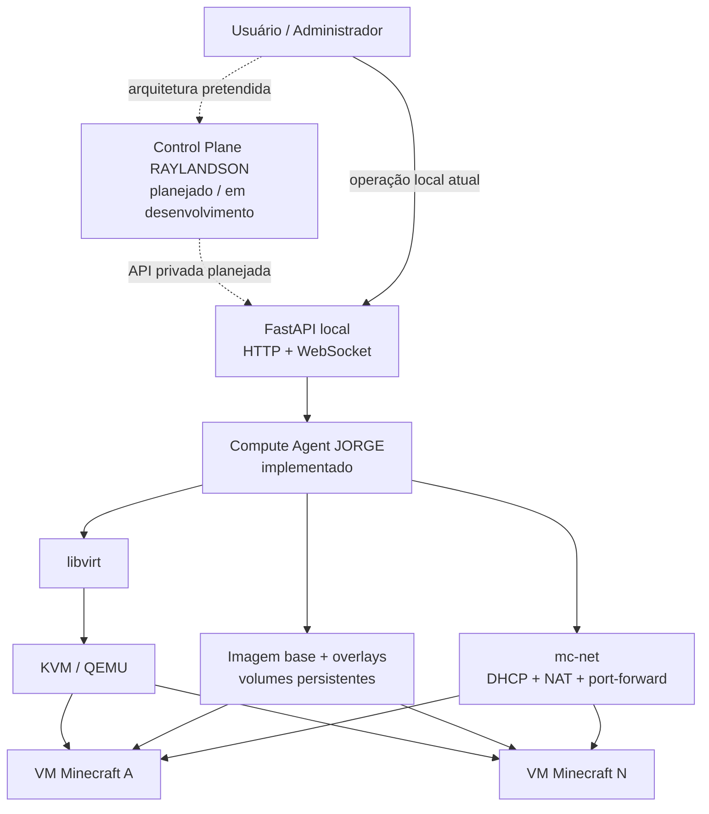
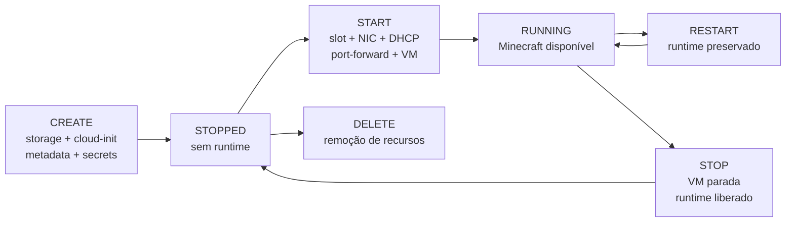

# MC-IaaS

Uma infraestrutura IaaS distribuída para provisionamento e gerenciamento de servidores Minecraft, desenvolvida no contexto da disciplina de **Sistemas Distribuídos**.

## Visão geral

O MC-IaaS explora, em escala acadêmica, como uma pequena cloud privada pode transformar uma requisição de alto nível em recursos concretos de computação. Em vez de iniciar diretamente um processo Minecraft, o sistema cria e controla uma máquina virtual com CPU, memória, discos, rede e dados persistentes próprios.

O fluxo conceitual é:

```text
requisição
    ↓
controle e validação
    ↓
seleção de capacidade computacional
    ↓
máquina virtual
    ↓
storage e networking
    ↓
servidor Minecraft
```

Minecraft foi escolhido como workload real porque torna observáveis vários problemas de infraestrutura: provisionamento, isolamento, consumo de recursos, exposição de portas, persistência do mundo, comandos remotos, monitoramento e recuperação. O foco do projeto, entretanto, não é o jogo em si; é a infraestrutura que o hospeda.

O componente mais desenvolvido atualmente é o **Compute Agent**, executado no Compute Node JORGE. O **Control Plane**, previsto para o servidor RAYLANDSON, ainda está em desenvolvimento conceitual e não possui implementação neste repositório.

Para detalhes de implementação, consulte a [documentação técnica do Compute Agent](compute-agent/README.md).

## Motivação

Executar vários servidores Minecraft de maneira gerenciável envolve mais do que iniciar processos. A infraestrutura precisa resolver, entre outros, os seguintes problemas:

- criar e remover máquinas dinamicamente;
- isolar workloads e seus recursos;
- limitar CPU e memória;
- reutilizar uma imagem de sistema sem duplicá-la integralmente;
- preservar o mundo independentemente da VM;
- atribuir endereços e portas sem colisões;
- publicar somente os serviços permitidos;
- observar estado, métricas e disponibilidade;
- desfazer operações incompletas;
- reconciliar estado após falhas.

O projeto usa esses problemas para construir um modelo reduzido, mas funcional, de IaaS especializada.

## Relação com Sistemas Distribuídos

O MC-IaaS reúne conceitos centrais da disciplina:

### Distribuição de responsabilidades

A arquitetura separa o plano de controle, responsável pela visão global, dos Compute Nodes, responsáveis por executar operações no hypervisor local. Essa separação está implementada apenas no lado do Compute Agent; a coordenação pelo Control Plane permanece planejada.

### Comunicação entre nós

O Compute Agent expõe uma API HTTP e WebSockets. A arquitetura prevê que o Control Plane use uma API privada para comandar Compute Nodes remotamente. No estado atual, os scripts iniciam a API somente em `127.0.0.1:8000`, e a integração remota ainda não foi implementada.

### Transparência

Uma operação como `START` esconde do consumidor detalhes de libvirt, NIC, DHCP, reserva de IP, firewall e port-forward. O usuário trabalha com o conceito de instância, não com cada recurso do host.

### Gerenciamento de recursos

CPU, memória, discos, IPs e portas externas são recursos finitos. O Compute Agent representa a capacidade de runtime como quatro slots estáticos e impede o uso de slots cujos IPs ou portas já estejam ocupados.

### Concorrência

Requisições simultâneas podem disputar o mesmo slot. O código atual não possui lock ou transação distribuída para serializar alocações concorrentes; esse é um limite conhecido e uma área de evolução.

### Falhas parciais e rollback

Criação de storage, definição de VM e preparação de runtime envolvem várias etapas. Os serviços executam rollback quando uma etapa intermediária falha, evitando deixar recursos parcialmente configurados sempre que possível.

### Recovery

No startup, o agente compara metadata, domínios e runtime. Uma VM parada que ainda conserva NIC, DHCP ou port-forward é tratada como estado recuperável e tem o runtime órfão removido.

### Consistência

O estado de uma instância é distribuído entre diferentes mecanismos:

```text
domínio libvirt
DHCP e leases
NIC persistente
port-forward e firewall
storage pools
metadata e secrets
estado da VM
```

O serviço de invariantes verifica parte dessas relações antes de considerar o Compute Node saudável.

### Observabilidade

Endpoints de health e métricas expõem estado do hypervisor, VM, Minecraft, CPU, memória, discos e rede. Isso permite observar remotamente um workload que está isolado dentro de uma VM.

### Persistência

O sistema separa o disco do sistema operacional do volume que contém o mundo. Assim, o lifecycle da VM e o lifecycle dos dados podem seguir políticas diferentes.

### Escalabilidade conceitual

A separação Control Plane/Compute Agent permite pensar em vários nós de computação. Multi-node scheduling e coordenação global, porém, ainda não estão implementados.

## Arquitetura



As linhas contínuas representam o fluxo implementado no Compute Node. As linhas tracejadas representam a arquitetura prevista para o Control Plane.

## Componentes

### Control Plane

O Control Plane deverá concentrar API externa, dashboard, scheduler, persistência global, monitoramento e coordenação de Compute Nodes. Atualmente existe somente uma descrição em [`control-plane/README.md`](control-plane/README.md); não há código executável do Control Plane neste repositório.

### Compute Agent

O `jorge-agent` é uma aplicação FastAPI executada no host de virtualização. Ela orquestra lifecycle, libvirt, storage, cloud-init, runtime, networking, Minecraft, RCON, métricas, consoles, recovery e invariantes.

### Hypervisor

KVM/QEMU executa as VMs, enquanto libvirt fornece a API usada pelo agente para definir domínios, controlar estado, anexar interfaces e consultar métricas.

### Storage

O storage combina uma imagem Ubuntu Minimal 24.04 base, overlays QCOW2 por instância e volumes RAW persistentes para os dados do Minecraft.

### Networking

A rede virtual `mc-net` oferece DHCP e NAT. O agente cria uma MAC determinística, reserva um IP, anexa a NIC e atualiza um arquivo de port-forward aplicado por um script de firewall do host.

### Minecraft

Minecraft é instalado dentro da VM por cloud-init. O serviço escuta internamente na porta `25565`; RCON usa `25575` apenas para controle interno pelo agente.

## Lifecycle de uma instância



`CREATE` e `START` são operações diferentes:

- `CREATE` prepara os discos, o seed cloud-init, o domínio persistente, metadata e secrets. A VM permanece parada e não consome slot, IP ou porta externa.
- `START` aloca runtime, configura NIC/DHCP/port-forward e inicia a VM.
- `RESTART` reinicia uma VM ativa sem liberar seu runtime.
- `STOP` encerra a VM e libera slot, lease, reserva DHCP, NIC e port-forward, preservando os discos.
- `DELETE` remove o domínio e artefatos descartáveis. O volume de dados pode ser preservado ou removido explicitamente.

## Modelo de storage

```text
Ubuntu 24.04 Minimal base QCOW2 (somente leitura)
        |
        +--> overlay QCOW2 da VM A
        +--> overlay QCOW2 da VM B
        +--> overlay QCOW2 da VM C

VM A --> volume RAW persistente A --> /srv/minecraft
VM B --> volume RAW persistente B --> /srv/minecraft
VM C --> volume RAW persistente C --> /srv/minecraft
```

Esse modelo economiza espaço, reutiliza uma imagem conhecida e separa o sistema operacional dos dados. No DELETE com preservação, o overlay do sistema é removido, mas o volume do mundo e a metadata são mantidos. Ainda não existe um endpoint de restore que reconstrua uma VM a partir desse volume.

## Modelo de networking

A infraestrutura usa a rede virtual `mc-net`, associada ao espaço `10.50.0.0/24`. A capacidade atual é estática:

| Slot | IP interno | Porta externa | Destino na VM |
|---:|---|---:|---:|
| 1 | `10.50.0.10` | `25565` | `25565` |
| 2 | `10.50.0.11` | `25566` | `25565` |
| 3 | `10.50.0.12` | `25567` | `25565` |
| 4 | `10.50.0.13` | `25568` | `25565` |

```text
porta externa do host
        ↓
firewall / DNAT
        ↓
IP reservado da VM
        ↓
Minecraft :25565
```

RCON escuta em `25575` dentro da VM e não deve aparecer como destino de uma regra pública. Essa condição é verificada pelo serviço de invariantes.

## Recovery e tolerância a falhas

O startup da aplicação executa primeiro a reconciliação e depois as invariantes:

```text
agente inicia
    ↓
carrega domínios e metadata
    ↓
VM parada + runtime existente?
    ├── não → estado mantido
    └── sim → runtime órfão liberado
    ↓
verifica invariantes
    ↓
API inicia somente se o estado for aceitável
```

Esse fluxo trata uma falha parcial importante: o processo pode terminar depois de a VM parar, mas antes de remover DHCP, NIC ou firewall. A reconciliação reduz a divergência entre o estado persistido e o estado observado no hypervisor.

## Estado atual

| Área | Estado | Evidência no repositório |
|---|---|---|
| Compute Agent FastAPI | Implementado | `compute-agent/src/jorge_agent/main.py` |
| CREATE/START/STOP/RESTART/DELETE | Implementado | `instance_service.py` e services associados |
| VMs KVM/QEMU via libvirt | Implementado | `domain_service.py` |
| Imagem base, overlays e volume persistente | Implementado | `storage_service.py` |
| Cloud-init e bootstrap Minecraft | Implementado | `cloud_init_service.py` |
| Slots, DHCP, NIC e port-forward | Implementado | `runtime_service.py` |
| Metadata e secrets locais | Implementado | services de persistência |
| Health e métricas | Implementado | `health_service.py` e `metrics_service.py` |
| RCON e consoles WebSocket | Implementado | services e bridges correspondentes |
| Recovery e invariantes | Implementado | startup, `recovery_service.py`, `invariant_service.py` |
| Suíte E2E da API | Implementada, execução opt-in | `compute-agent/tests/e2e/` |
| Control Plane | Em desenvolvimento conceitual | somente README, sem código |
| Scheduler multi-node | Planejado | sem implementação atual |
| Concorrência global de alocação | Planejada | não há lock/transação global |
| Autenticação entre nós | Planejada | API atual não implementa autenticação |

## Testes

O repositório contém uma suíte E2E automatizada que percorre o lifecycle real da API: health, invariantes, criação, listagem, start, readiness do Minecraft e RCON, métricas, restart, stop, novo start, DELETE destrutivo, verificação de artefatos e invariantes finais.

A suíte é marcada como destrutiva e exige `MC_IAAS_RUN_E2E=1`; sem esse opt-in ela é ignorada. Não há atualmente uma suíte de testes unitários versionada. Validações integradas adicionais foram realizadas manualmente durante o desenvolvimento, mas não são substitutas para testes automatizados reproduzíveis.

Consulte o [README do Compute Agent](compute-agent/README.md#testes) para o comando e os requisitos.

## Estrutura do repositório

```text
mc-iaas/
├── compute-agent/          # API e automação do Compute Node JORGE
├── control-plane/          # descrição do componente futuro RAYLANDSON
├── infra/
│   └── scripts/            # helper de infraestrutura versionado
├── start.sh                # inicialização do Compute Node a partir da raiz
└── README.md               # visão arquitetural do projeto
```

Não há atualmente um diretório `docs/` nem implementação do Control Plane neste checkout.

## Por que este projeto é interessante

O MC-IaaS conecta virtualização, redes, storage, coordenação, observabilidade, rollback e recuperação em um único sistema funcional. Cada instância atravessa limites entre API, filesystem, hypervisor, rede virtual e software dentro da VM, o que torna visíveis problemas reais de consistência e falhas parciais.

O workload Minecraft ajuda a observar o resultado: uma VM precisa inicializar, montar seu volume, baixar ou validar o servidor, expor a porta correta e responder a health e RCON. Isso fornece um caso concreto para estudar abstrações de infraestrutura distribuída sem afirmar que a implementação atual já possui a escala ou a robustez de uma cloud de produção.

## Limitações e evolução

As principais limitações atuais são:

- Control Plane e scheduler distribuído ainda não implementados;
- API vinculada ao loopback e sem autenticação própria;
- quatro slots fixos de runtime;
- ausência de lock para alocações concorrentes;
- dependência de configuração e scripts previamente instalados no host;
- ausência de testes unitários;
- ausência de restore automatizado para mundos preservados;
- validação WAN e operação multi-node fora do escopo atual.

Próximas evoluções coerentes com a arquitetura incluem integração do Control Plane, autenticação entre nós, controle de concorrência, quotas, observabilidade agregada e ampliação da cobertura automatizada.
