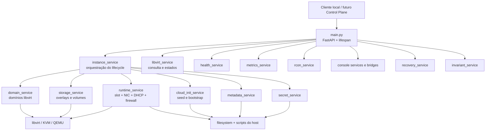
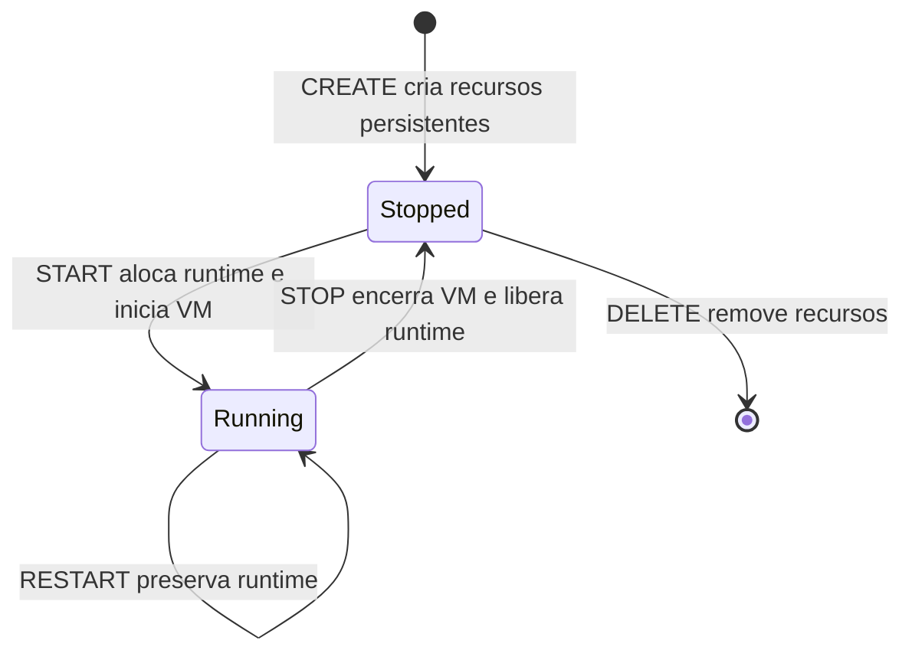
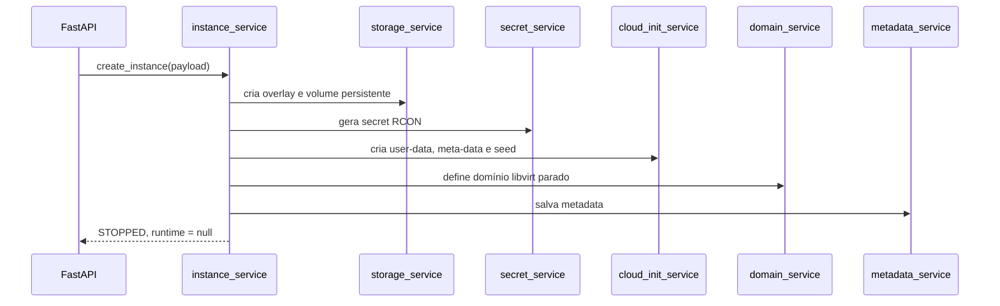
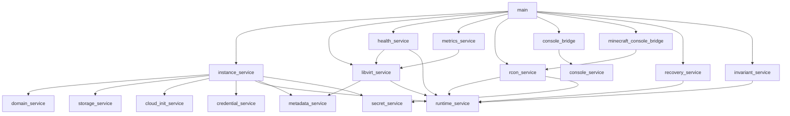

# MC-IaaS Compute Agent

O `jorge-agent` é o daemon/API local do Compute Node JORGE. Ele recebe operações de alto nível sobre instâncias Minecraft e as transforma em mudanças reais no hypervisor, storage, rede e filesystem do host.

Este documento descreve o componente implementado. Para a visão geral do projeto e a arquitetura Control Plane/Compute Node, consulte o [README principal](../README.md).

## Visão geral

O agente é uma aplicação FastAPI executada no mesmo host que KVM/QEMU e libvirt. Os scripts atuais publicam a API em `http://127.0.0.1:8000`; portanto, o acesso remoto pelo futuro Control Plane ainda depende de uma camada de integração e segurança que não está implementada neste repositório.

Um START percorre aproximadamente este caminho:

```text
POST /instances/{name}/start
        ↓
instance_service
        ↓
runtime_service
        ├── seleciona slot
        ├── cria MAC e NIC
        ├── reserva DHCP
        ├── atualiza port-forward
        └── aplica firewall
        ↓
domain_service
        └── inicia o domínio libvirt
```

O agente mantém a separação entre recursos persistentes, criados no CREATE, e recursos de runtime, consumidos somente no START.

## Responsabilidades

- criar e remover domínios libvirt;
- criar overlays de sistema e volumes persistentes;
- produzir seeds NoCloud com cloud-init;
- gerar credenciais de VM e secrets de RCON;
- orquestrar CREATE, START, STOP, RESTART e DELETE;
- alocar e liberar slots de runtime;
- gerenciar NIC, MAC, reservas e leases DHCP;
- manter configuração de port-forward e aplicar firewall;
- inicializar Minecraft dentro da VM;
- executar comandos RCON;
- expor health e métricas;
- oferecer consoles WebSocket;
- reconciliar runtime órfão no startup;
- verificar invariantes do Compute Node.

## Arquitetura interna



`main.py` contém a borda HTTP/WebSocket e o lifecycle de startup. `instance_service.py` é a camada de orquestração das mutações; os demais services encapsulam responsabilidades específicas.

## API atual

| Método | Endpoint | Responsabilidade |
|---|---|---|
| `GET` | `/health` | health básico do processo |
| `GET` | `/hypervisor/health` | versão, host e contagem de domínios libvirt |
| `GET` | `/instances` | lista instâncias definidas |
| `POST` | `/instances` | cria storage, cloud-init, domínio, metadata e secrets |
| `GET` | `/instances/{name}` | detalhe de uma instância |
| `POST` | `/instances/{name}/start` | aloca runtime e inicia a VM |
| `POST` | `/instances/{name}/stop` | para a VM e libera runtime |
| `POST` | `/instances/{name}/restart` | reinicia mantendo runtime |
| `DELETE` | `/instances/{name}` | remove a instância; aceita `delete_data` |
| `GET` | `/instances/{name}/health` | estado da VM e do Minecraft |
| `GET` | `/instances/{name}/metrics` | CPU, memória, storage e rede |
| `POST` | `/instances/{name}/minecraft/command` | executa comando RCON |
| `WS` | `/instances/{name}/console` | console serial da VM |
| `WS` | `/instances/{name}/minecraft/console` | console de comandos Minecraft via RCON |

A API não implementa autenticação própria. Os scripts a vinculam ao loopback, e a comunicação segura com o Control Plane continua sendo trabalho futuro.

## Fluxos principais



### CREATE



O payload precisa aceitar a EULA. O schema permite memória entre 512 e 2048 MiB, fixa `vcpus` em 1 e usa Minecraft `26.2` como versão padrão e atualmente catalogada.

Se a senha da VM não for informada, `credential_service.py` gera uma senha e o CREATE a devolve uma vez em `generated_password`. O hash usado pelo cloud-init é produzido com `sha512_crypt`. O valor não é gravado na metadata.

O rollback do CREATE ocorre na ordem inversa para domínio, cloud-init, storage e secrets quando uma etapa falha. CREATE não anexa NIC, não reserva IP e não publica porta.

### START

O runtime é preparado antes do boot:

1. confirma que o domínio existe e está parado;
2. consulta reservas DHCP, leases IPv4 e portas publicadas;
3. escolhe o primeiro slot disponível;
4. deriva uma MAC determinística do nome da instância;
5. anexa uma interface VirtIO persistente ao domínio;
6. adiciona uma reserva DHCP live e persistente;
7. grava o port-forward do Minecraft;
8. executa o script de firewall;
9. inicia o domínio libvirt.

Se a preparação falhar, `runtime_service.py` executa ações de rollback em ordem inversa. Se o boot do domínio falhar depois da preparação, `instance_service.py` chama a liberação de runtime.

### STOP

`domain_service.py` solicita shutdown gracioso e aguarda até 60 segundos. Depois que a VM está inativa, o runtime é liberado:

1. leases DHCP IPv4 são liberados pelo helper do host;
2. a regra de port-forward é removida e o firewall reaplicado;
3. a reserva DHCP é removida;
4. a NIC persistente é destacada.

Falhas de cleanup são agregadas em `RuntimeCleanupError`, permitindo relatar mais de um recurso que não pôde ser removido.

### RESTART

RESTART exige uma VM ativa com runtime existente. O agente envia `reboot(0)` ao domínio e retorna a mesma alocação de slot, IP e porta. DHCP, NIC e port-forward não são recriados.

### DELETE

DELETE primeiro garante que a VM esteja parada e sem runtime. Em seguida remove domínio, cloud-init, secrets e disco de sistema.

| Parâmetro | Resultado |
|---|---|
| `delete_data=false` | preserva o volume RAW do mundo e marca a metadata como deletada |
| `delete_data=true` | remove também volume de dados e metadata |

O default é `delete_data=false`. Ainda não existe um endpoint de restore para uma metadata marcada como deletada.

## Contrato da máquina virtual

O domínio criado atualmente possui:

- tipo `kvm` e arquitetura `x86_64`;
- 1 vCPU;
- memória configurável entre 512 MiB e 2 GiB;
- firmware/boot convencional por disco;
- ACPI e APIC;
- console serial PTY;
- nenhuma NIC no CREATE;
- Ubuntu 24.04 Minimal como imagem base;
- OpenJDK 25 e Minecraft instalados pelo cloud-init.

Mapeamento dos discos:

| Dispositivo | Formato | Função |
|---|---|---|
| `vda` | QCOW2 | sistema operacional, baseado na imagem base |
| `vdb` | RAW, somente leitura | seed NoCloud do cloud-init |
| `vdc` | RAW | dados persistentes montados em `/srv/minecraft` |

A interface de rede VirtIO é anexada somente no START e removida no STOP.

## Storage

Os nomes de pools configurados são:

| Pool | Uso atual |
|---|---|
| `mc-images` | pool de imagens ativado pelos scripts de infraestrutura |
| `mc-instances` | overlays QCOW2 dos discos de sistema |
| `mc-volumes` | volumes RAW persistentes do Minecraft |

O agente lê a imagem base diretamente em:

```text
/srv/mc-iaas/storage/images/ubuntu-24.04-minimal-base.qcow2
```

O disco de sistema tem 10 GiB e usa a imagem base como backing store. O volume de dados tem 5 GiB e allocation inicial igual a zero. A invariante exige que a imagem base exista e não tenha bits de escrita.

Os diretórios de backing dos pools `mc-instances` e `mc-volumes` são definidos na configuração libvirt do host; o código Python trabalha com os nomes dos pools, não fixa esses backing paths.

## Runtime slots

`RuntimeSlot` possui três campos:

```text
slot
ip
external_port
```

| Slot | IP | Porta externa |
|---:|---|---:|
| 1 | `10.50.0.10` | `25565` |
| 2 | `10.50.0.11` | `25566` |
| 3 | `10.50.0.12` | `25567` |
| 4 | `10.50.0.13` | `25568` |

Um slot é consumido no START e liberado no STOP. A seleção ignora slots com IP reservado, lease IPv4 ativo ou porta externa já presente no arquivo de port-forward. Não há lock para duas alocações concorrentes; a capacidade também é fixa em quatro slots.

## Networking

### Rede e endereçamento

O agente usa a rede libvirt `mc-net`, no espaço `10.50.0.0/24`. O helper de liberação DHCP opera sobre a bridge `virbr50`.

A MAC de cada instância é determinística:

```text
52:54:00 + primeiros 3 bytes de SHA-256(nome)
```

Isso permite reencontrar reservas e interfaces pelo nome ou pela MAC.

### DHCP

No START, o agente adiciona um elemento DHCP host à configuração live e persistente da rede. No STOP, chama `/srv/mc-iaas/scripts/release-dhcp-lease.sh` para cada lease IPv4 e remove a reserva.

O helper versionado em `infra/scripts/release-dhcp-lease.sh` valida IP e MAC antes de executar `/usr/bin/dhcp_release` na `virbr50`. Ele precisa ser instalado no caminho esperado pelo agente.

### Port-forward e firewall

As regras desejadas ficam em:

```text
/srv/mc-iaas/config/port-forwards.conf
```

Cada linha contém porta externa, IP interno e porta interna. Depois de adicionar ou remover uma entrada, o agente executa:

```text
/srv/mc-iaas/scripts/apply-firewall.sh
```

Esse script é uma dependência operacional do host, mas não está versionado neste checkout. O START também o executa antes de subir a API.

Minecraft usa `25565` dentro da VM. RCON usa `25575` e não é publicado pelo port-forward. `invariant_service.py` sinaliza qualquer regra cujo destino interno seja a porta RCON.

## Metadata e secrets

### Metadata

Arquivos em `/srv/mc-iaas/metadata/{name}.json` guardam:

- nome da instância;
- usuário da VM;
- versão do Minecraft;
- memória e vCPUs;
- caminho do volume de dados;
- marcadores de deleção e preservação quando aplicável.

O formato JSON é usado por listagem, detalhes, recovery e invariantes. Metadata marcada como `deleted` é ignorada por recovery e invariantes de domínio.

### Secrets

Arquivos em `/srv/mc-iaas/secrets/{name}.json` guardam somente o secret RCON da instância. O diretório recebe modo `0700`; o arquivo é criado atomicamente com `O_EXCL` e modo `0600`.

O secret é gerado com `secrets.token_urlsafe(24)`. Valores reais de senha nunca devem ser copiados para documentação, logs ou testes.

## Cloud-init

Artefatos por instância são criados em:

```text
/srv/mc-iaas/cloud-init/{name}/
├── user-data
├── meta-data
└── seed.img
```

`cloud-localds` transforma `user-data` e `meta-data` em um seed NoCloud. O seed é anexado como `vdb` via VirtIO e somente leitura.

Em alto nível, o cloud-init:

- cria o usuário solicitado e configura sua senha hash;
- instala OpenJDK 25 e `curl`;
- cria usuário e grupo `minecraft` com UID/GID 2000;
- formata `vdc` como ext4 quando necessário;
- registra o volume em `/etc/fstab` e o monta em `/srv/minecraft`;
- baixa e valida o servidor por SHA-1;
- grava a EULA aceita;
- configura RCON;
- instala e inicia `minecraft.service`.

O catálogo de artefatos suporta atualmente a versão Minecraft `26.2` com URL e hash fixados no serviço.

## Minecraft e RCON

| Serviço | Porta interna | Exposição |
|---|---:|---|
| Minecraft | `25565` | publicado pelo slot de runtime |
| RCON | `25575` | somente comunicação interna do agente |

`rcon_service.py` implementa autenticação e pacotes do protocolo RCON diretamente sobre TCP. O agente carrega o secret local e se conecta ao IP privado da VM. Os valores `SERVERDATA_*` pertencem ao protocolo, não à configuração operacional.

Existe uma janela normal de readiness em que a porta Minecraft já aceita conexões, mas RCON ainda responde `Connection refused`. Por isso, a suíte E2E possui retry separado para o primeiro comando RCON.

### Console da VM versus console Minecraft

- **VM serial console:** `console_service.py` abre um stream libvirt para o console serial do domínio; `console_bridge.py` transporta bytes entre esse stream e um WebSocket.
- **Minecraft console:** `minecraft_console_bridge.py` recebe comandos de texto por WebSocket e os executa via RCON. Não é um terminal do sistema operacional.

## Health e métricas

### Health

`health_service.py` combina estado do domínio, runtime e uma conexão TCP à porta Minecraft:

| Estado Minecraft | Significado |
|---|---|
| `stopped` | domínio não está ativo |
| `online` | domínio ativo, runtime presente e porta `25565` acessível |
| `unavailable` | domínio ativo sem runtime ou porta não acessível |

O probe TCP usa timeout de 1 segundo. Ele verifica disponibilidade da porta Minecraft, não readiness do RCON.

### Métricas

O endpoint de métricas coleta:

- CPU: tempo acumulado e uso percentual amostrado por 0,5 segundo;
- memória: configurada, corrente e RSS quando disponível;
- storage: capacidade e allocation de sistema e dados;
- rede: bytes recebidos e transmitidos pelas interfaces do domínio.

Valores como CPU, RSS, allocation e contadores de rede são dinâmicos.

## Recovery

`recovery_service.py` percorre metadata não deletada e domínios existentes durante o startup. Para cada instância:

- VM ativa: estado mantido;
- VM parada sem runtime: estado mantido;
- VM parada com runtime: `release_instance_runtime()` é executado;
- metadata sem nome ou sem domínio: recovery não toma decisão destrutiva;
- falhas individuais: registradas em `RecoveryReport.errors`.

`main.py` interrompe o startup se o relatório contiver erros. Depois do recovery, executa as invariantes e também interrompe o startup se o Compute Node não estiver saudável.

## Invariantes

`invariant_service.py` verifica atualmente:

- existência e atividade da rede `mc-net`;
- existência e atividade dos pools `mc-instances` e `mc-volumes`;
- existência da imagem base;
- ausência de permissão de escrita na imagem base;
- existência dos scripts de firewall e liberação DHCP;
- ausência de encaminhamento público para RCON;
- validade mínima da metadata não deletada;
- existência de domínio para cada metadata gerenciada;
- VM ativa deve possuir runtime;
- VM parada não deve possuir runtime;
- disponibilidade da conexão libvirt.

O serviço não verifica atualmente, por exemplo, permissões de secrets, conteúdo integral do cloud-init ou atividade do pool `mc-images`. Esses itens não devem ser assumidos como invariantes implementadas.

## Configuração centralizada

`src/jorge_agent/config.py` concentra configuração estática compartilhada:

| Objeto | Conteúdo |
|---|---|
| `LIBVIRT` | URI `qemu:///system`, rede `mc-net` e nomes dos pools |
| `STORAGE` | raiz, imagem base e tamanhos dos discos |
| `NETWORK` | portas, arquivo de forwards e scripts do host |
| `PATHS` | diretórios de cloud-init, metadata e secrets |
| `RUNTIME_SLOTS` | quatro combinações slot/IP/porta |

Os services importam esses objetos em vez de repetir caminhos e nomes. Estado dinâmico, leases, senhas e métricas não pertencem a `config.py`.

## Estrutura dos arquivos

```text
compute-agent/
├── pyproject.toml
├── start.sh
├── stop.sh
├── stop-final.sh
├── tests/
│   └── e2e/
│       ├── __init__.py
│       └── test_instance_lifecycle.py
└── src/
    └── jorge_agent/
        ├── __init__.py
        ├── config.py
        ├── main.py
        ├── schemas/
        │   ├── __init__.py
        │   └── instance.py
        └── services/
            ├── __init__.py
            ├── cloud_init_service.py
            ├── console_bridge.py
            ├── console_service.py
            ├── credential_service.py
            ├── domain_service.py
            ├── health_service.py
            ├── instance_service.py
            ├── invariant_service.py
            ├── libvirt_service.py
            ├── metadata_service.py
            ├── metrics_service.py
            ├── minecraft_console_bridge.py
            ├── rcon_service.py
            ├── recovery_service.py
            ├── runtime_service.py
            ├── secret_service.py
            └── storage_service.py
```

Responsabilidade de cada módulo:

| Arquivo | Responsabilidade real |
|---|---|
| `config.py` | dataclasses e objetos de configuração estática compartilhada |
| `main.py` | aplicação FastAPI, endpoints, WebSockets e startup recovery/invariants |
| `schemas/instance.py` | validação de entrada, enums e modelos públicos de resposta |
| `services/instance_service.py` | orquestra lifecycle e rollback entre services |
| `services/domain_service.py` | define XML do domínio e controla start, shutdown, reboot e undefine |
| `services/storage_service.py` | cria e remove overlays e volumes nos pools libvirt |
| `services/cloud_init_service.py` | gera configuração NoCloud e bootstrap da VM/Minecraft |
| `services/runtime_service.py` | aloca slot e gerencia NIC, DHCP, lease, forwards e firewall |
| `services/metadata_service.py` | persiste e lê descrição não secreta da instância |
| `services/secret_service.py` | gera, protege, lê e remove secret RCON |
| `services/credential_service.py` | resolve senha fornecida ou gera credencial da VM |
| `services/libvirt_service.py` | mapeia estados e fornece listagem/detalhe/hypervisor health |
| `services/health_service.py` | combina estado da VM com probe TCP do Minecraft |
| `services/metrics_service.py` | coleta CPU, memória, volumes e interfaceStats |
| `services/rcon_service.py` | implementa protocolo e execução de comando RCON |
| `services/console_service.py` | mantém conexão e stream do console serial libvirt |
| `services/console_bridge.py` | bridge assíncrona entre stream serial e WebSocket |
| `services/minecraft_console_bridge.py` | bridge WebSocket de comandos para RCON |
| `services/recovery_service.py` | reconcilia runtime de VMs paradas no startup |
| `services/invariant_service.py` | verifica pré-condições e coerência operacional do nó |
| `__init__.py` | marca os diretórios como pacotes; não contém lógica atualmente |

## Dependências entre services



O principal ponto de acoplamento é `instance_service.py`, que conhece os services necessários para cada transição. `runtime_service.py` também reúne responsabilidades que atravessam libvirt, XML de rede, filesystem e subprocessos privilegiados.

## Diretórios operacionais

O layout esperado no Compute Node é aproximadamente:

```text
/srv/mc-iaas/
├── storage/
│   ├── images/
│   │   └── ubuntu-24.04-minimal-base.qcow2
│   ├── instances/          # backing esperado do pool mc-instances
│   └── volumes/            # backing esperado do pool mc-volumes
├── cloud-init/
│   └── {instance}/
├── metadata/
├── secrets/
├── config/
│   └── port-forwards.conf
├── scripts/
│   ├── apply-firewall.sh
│   └── release-dhcp-lease.sh
├── logs/
│   └── jorge-agent.log
└── run/
    └── jorge-agent.pid
```

Os caminhos de `instances/` e `volumes/` dependem da configuração efetiva dos pools libvirt. O script `apply-firewall.sh` e a instalação dos helpers no host não estão integralmente representados neste checkout.

## Scripts de lifecycle

### `compute-agent/start.sh`

1. verifica e inicia `mc-net`;
2. verifica e inicia os três pools;
3. aplica o firewall;
4. inicia Uvicorn com `nohup` se a API não estiver ativa;
5. grava PID, aguarda `/health` e mostra o caminho do log.

O repositório também contém `../start.sh`, que cumpre papel semelhante a partir da raiz, mas usa verificações `virsh` mais diretas. Os dois scripts não são wrappers um do outro.

### `compute-agent/stop.sh`

Para somente o processo `jorge-agent`. Usa o PID file e, como fallback, procura o processo Uvicorn. Depois de 10 segundos, envia `SIGKILL`. Não para VMs, rede ou pools.

### `compute-agent/stop-final.sh`

Executa shutdown operacional completo:

1. garante que o agente esteja disponível;
2. lista e para graciosamente todas as instâncias;
3. verifica invariantes;
4. para o agente;
5. desativa `mc-net` e os pools em ordem inversa.

Os dados persistentes são preservados. Esse script não equivale a DELETE das instâncias.

Não há unit de systemd do agente versionada atualmente; o gerenciamento implementado neste checkout usa scripts, `nohup`, log e PID file.

## Como executar

### Pré-requisitos

O host precisa fornecer:

- Linux com KVM/QEMU e libvirt;
- Python 3.11 ou superior;
- `cloud-localds`;
- rede `mc-net` e pools libvirt configurados;
- imagem base no caminho esperado;
- helpers de DHCP e firewall instalados;
- permissões/sudo não interativo para os scripts necessários.

### Ambiente Python

Na raiz de `compute-agent/`:

```bash
python3 -m venv .venv
.venv/bin/python -m pip install -e '.[compute,dev]'
```

O extra `compute` instala `libvirt-python`; o extra `dev` instala `pytest` e `httpx`.

### Inicialização

```bash
./start.sh
```

Para desenvolvimento local no Compute Node, a aplicação também pode ser iniciada diretamente:

```bash
.venv/bin/python -m uvicorn \
    jorge_agent.main:app \
    --host 127.0.0.1 \
    --port 8000
```

Health básico:

```bash
curl -fsS http://127.0.0.1:8000/health
```

## Testes

A suíte em `tests/e2e/test_instance_lifecycle.py` usa `pytest` e `httpx` contra a API real. Ela cobre:

```text
API health e invariantes
→ CREATE / GET / LIST
→ START e readiness
→ health / metrics / RCON
→ RESTART e novo readiness
→ STOP
→ segundo START / STOP
→ DELETE destrutivo
→ verificação de artefatos
→ invariantes finais
```

O teste cria VM, volumes e regras de rede reais. Por segurança, é marcado com `e2e` e ignorado sem opt-in explícito.

No Compute Node JORGE:

```bash
MC_IAAS_RUN_E2E=1 \
.venv/bin/python -m pytest \
    -v -s -m e2e tests/e2e
```

Usar `python -m pytest` garante que o pytest executado pertence ao mesmo Python do venv que contém `libvirt-python` e o pacote editável.

Variáveis opcionais:

| Variável | Default | Uso |
|---|---:|---|
| `MC_IAAS_API_URL` | `http://127.0.0.1:8000` | base URL da API |
| `MC_IAAS_REQUEST_TIMEOUT_SECONDS` | `90` | timeout HTTP |
| `MC_IAAS_MINECRAFT_TIMEOUT_SECONDS` | `300` | primeiro boot/readiness |
| `MC_IAAS_RCON_TIMEOUT_SECONDS` | `60` | readiness RCON |
| `MC_IAAS_POLL_INTERVAL_SECONDS` | `2` | intervalo de polling |

Sem opt-in, a coleta é segura:

```bash
.venv/bin/python -m pytest -m e2e
# resultado esperado: skipped
```

Não há atualmente testes unitários versionados.

## Limitações atuais

- somente quatro slots de runtime;
- ausência de lock para START/alocação concorrente;
- API restrita ao loopback e sem autenticação própria;
- Control Plane e scheduler distribuído não implementados;
- configuração libvirt e scripts privilegiados dependem do host;
- ausência de restore para volume preservado;
- shutdown síncrono pode aguardar até 60 segundos;
- health Minecraft não implica readiness imediata do RCON;
- catálogo com uma única versão Minecraft;
- ausência de testes unitários e de concorrência;
- integração WAN e múltiplos Compute Nodes não validados neste código.

## Próximos passos

Evoluções coerentes com o estado atual incluem:

- autenticação e canal privado entre Control Plane e agente;
- scheduler e inventário de múltiplos nós;
- lock/transação para alocação de slots;
- quotas e políticas de capacidade;
- restore explícito de mundos preservados;
- observabilidade agregada;
- testes unitários e cenários de falha controlada.

Esses itens são planejados ou possibilidades de evolução; não estão implementados no estado atual.

## Evolução da arquitetura interna

O agente está organizado principalmente por services. A leitura das dependências evidencia alguns limites de domínio que podem orientar uma modularização futura sem determinar uma estrutura definitiva:

- **virtualization:** domínio, estado libvirt e console serial;
- **storage:** imagem base, overlays e volumes persistentes;
- **runtime/network:** slots, NIC, DHCP, leases, port-forward e firewall;
- **provisioning:** cloud-init, credenciais e bootstrap;
- **minecraft:** RCON, health e console de comandos;
- **observability:** health, métricas e invariantes;
- **persistence:** metadata e secrets;
- **orchestration/recovery:** lifecycle, rollback e reconciliação.

Hoje, `instance_service.py` coordena vários desses limites e `runtime_service.py` concentra operações de rede e infraestrutura. Tornar essas fronteiras explícitas na documentação facilita avaliar, no futuro, onde separar contratos sem alterar prematuramente uma implementação que já funciona.
