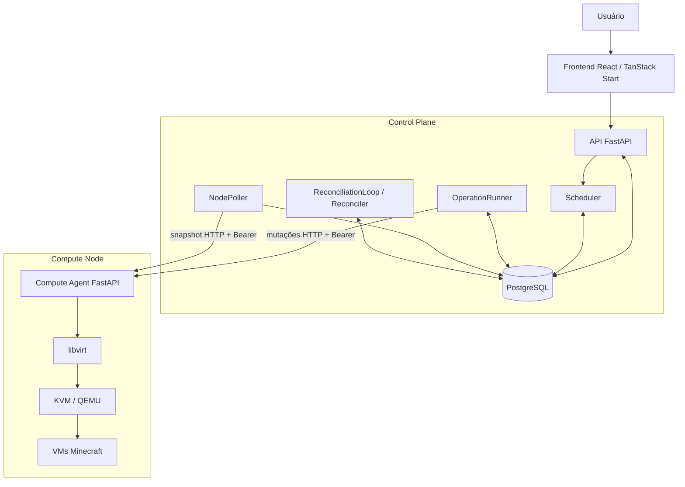
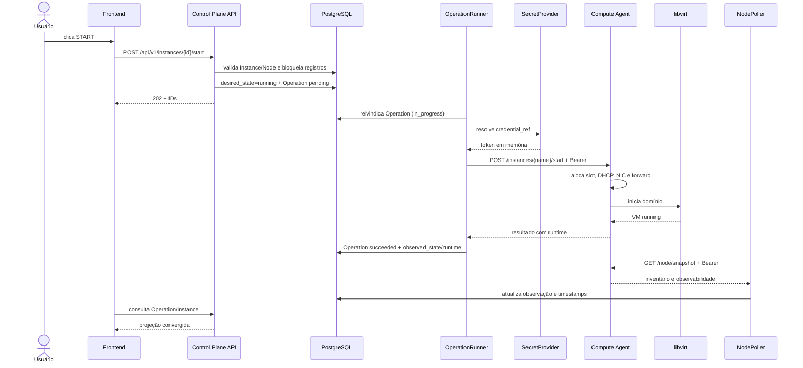
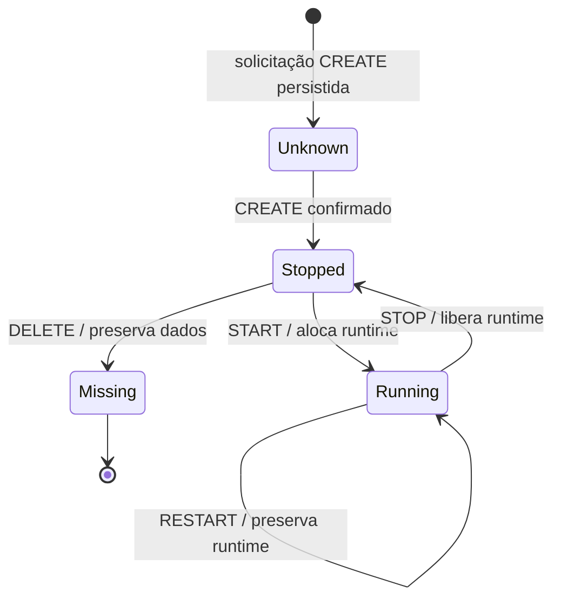
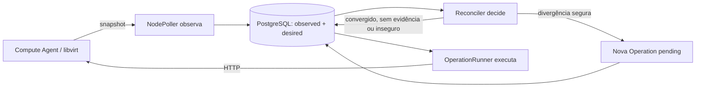
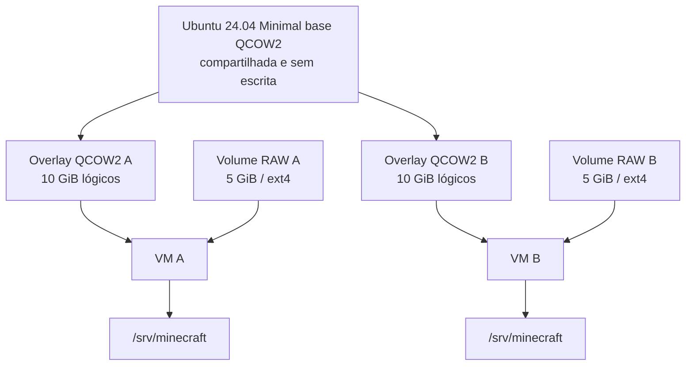
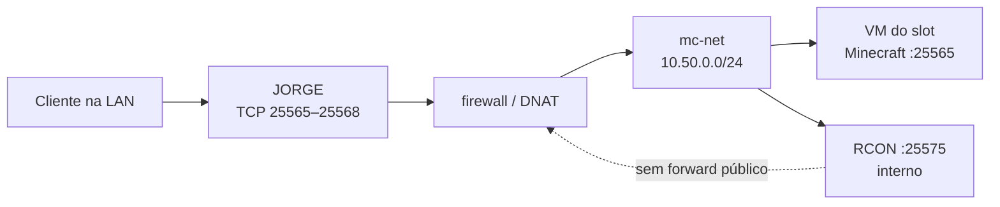

# Arquitetura do MC-IaaS

Este documento descreve a arquitetura implementada do MC-IaaS, as fronteiras de autoridade entre seus componentes e os mecanismos usados para coordenar estado, recursos e falhas. Ele é uma referência técnica; instruções resumidas de instalação e uso permanecem no [README principal](../README.md).

Documentação complementar dos componentes:

- [Compute Agent](../compute-agent/README.md)
- [Backend do Control Plane](../control-plane/backend/README.md)
- [Frontend do Control Plane](../control-plane/frontend/README.md)

O código versionado é a fonte de verdade para comportamento. Endereços, regras de firewall e serviços do laboratório são configuração de implantação e aparecem explicitamente identificados como tal.

## 1. Visão arquitetural

O MC-IaaS é uma Infraestrutura como Serviço (IaaS) especializada em servidores Minecraft. A aplicação recebida pelo usuário é abstrata — uma instância com memória, vCPU e versão — enquanto a execução concreta exige domínio libvirt, discos, interface de rede, reserva DHCP, encaminhamento de porta e bootstrap do servidor.

A arquitetura separa coordenação global e execução local. O Control Plane persiste intenção e decide em qual Compute Node uma instância será criada. O Compute Agent controla os recursos de seu próprio host. O estado real de uma VM é consultado no libvirt; o estado do Minecraft é observado separadamente por uma sonda TCP.



O Reconciler não chama o Agent. Ele usa observações persistidas para decidir se deve criar uma nova Operation. O OperationRunner é o único worker do Control Plane que despacha mutações remotas; o NodePoller realiza leituras periódicas.

## 2. Distribuição física

A propriedade arquitetural é que Control Plane e Compute Agent podem rodar em hosts diferentes. Na implantação validada do laboratório, a distribuição é:

| Plano | Host | IP LAN | Componentes |
|---|---|---|---|
| Controle | RAYLANDSON | `192.168.1.4` | Frontend, backend FastAPI, PostgreSQL, Scheduler, OperationRunner, NodePoller e ReconciliationLoop |
| Execução | JORGE | `192.168.1.22` | Compute Agent, libvirt, KVM/QEMU, storage, rede virtual e VMs |
| Dados do jogo | JORGE e VMs `mc-net` | Host e `10.50.0.0/24` | Portas públicas do Minecraft e tráfego até as VMs |

O plano de controle recebe comandos do navegador e mantém o estado global durável. O plano de execução transforma comandos autenticados em mudanças no hypervisor e no host. O data plane do Minecraft transporta conexões dos clientes até a porta `25565` dentro de cada VM e não passa pelo frontend nem pelo backend.

No deploy informado, o Agent escuta em `0.0.0.0:8000`, aceitando loopback e LAN, e o UFW permite TCP 8000 somente a partir de RAYLANDSON. A porta não deve ser exposta à Internet e a autenticação Bearer continua obrigatória. O `compute-agent/start.sh` versionado ainda inicia o Agent em `127.0.0.1:8000`, portanto não reproduz sozinho o bind do deploy distribuído.

## 3. Separação de responsabilidades

| Componente | Responsabilidade | Autoridade |
|---|---|---|
| Frontend | Interação, projeção visual e acompanhamento de Operations | Não é autoridade de estado; mantém apenas preferências locais de Settings |
| API do Control Plane | Validação, consulta e registro de solicitações | Contrato público e início das transações de domínio |
| Scheduler | Seleção global de Compute Node no CREATE | Placement inicial a partir do último estado elegível persistido |
| PostgreSQL | Nodes, Instances, Operations e Events | Estado global durável conhecido pelo Control Plane |
| OperationRunner | Despacho de mutações pendentes | Transição operacional da fila; não determina sozinho a realidade física |
| NodePoller | Coleta periódica de snapshots | Produz observações, mas o conteúdo nasce no Agent/libvirt |
| Reconciler | Comparação entre intenção e observação | Decide apenas correções conservadoras suportadas pela matriz implementada |
| Compute Agent | Orquestração local de lifecycle, storage e rede | Autoridade operacional sobre recursos do Compute Node |
| libvirt | Domínios, atividade e interfaces das VMs | Fonte primária para o estado real das VMs |
| Rede e filesystem locais | Leases, forwards, volumes, metadata e secrets | Estado material local, inspecionado pelo Agent |
| Volume de dados | Mundo e arquivos do servidor | Persistência da workload, independente do registro global |

“Fonte de verdade” não significa uma única base para todos os fatos. O PostgreSQL é autoritativo para intenção, placement e histórico do Control Plane. O libvirt e os recursos locais são autoritativos para a realidade executada. `observed_state` é uma cópia temporal dessa realidade e só é tão atual quanto `last_observed_at`.

## 4. Fluxo de uma requisição

START exemplifica a travessia completa entre os dois hosts:



A resposta `202 Accepted` da API significa que a solicitação foi persistida, não que a VM já iniciou. O frontend consulta a Operation até encontrar um estado terminal ou encerrar seu acompanhamento. O backend pode continuar executando depois que o navegador deixa de consultar.

## 5. Modelo de domínio do Control Plane

### ComputeNode

Representa um Agent administrável. Guarda nome, endpoint, `credential_ref`, habilitação, reachability e a última observação de health, readiness, capacidade e métricas. A credencial é uma referência: o token não é uma coluna do modelo nem aparece na resposta pública.

Um Node agrega muitas Instances e Operations. Seus timestamps distinguem contato recente (`last_seen_at`), observação completa suficiente para scheduling (`last_observed_at`) e coleta de métricas (`metrics_observed_at`).

### Instance

Representa a identidade global da workload. Guarda recursos solicitados, versão Minecraft, Compute Node atribuído, estados desejado e observado, status do Minecraft e último runtime observado. O vínculo ao Node torna o placement sticky.

DELETE produz `deleted_at` em vez de apagar o registro. O tombstone preserva relações com Operations e Events e mantém o nome reservado pelo índice único.

### Operation

Representa uma solicitação durável de mutação. Contém tipo, estado, Instance, Node, timestamps, contador de tentativas, chave de idempotência, erro sanitizado e metadata interna. A fila é a própria tabela: o runner reivindica registros `pending` com bloqueio e `SKIP LOCKED`.

### Event

Registra acontecimentos relevantes com tipo, nível, componente, mensagem e referências opcionais ao Node, Instance e Operation. Events explicam transições e decisões; não armazenam amostras de telemetria.

## 6. Desired state e observed state

`desired_state` registra o que o Control Plane pretende manter:

- `stopped`: a instância deve existir parada;
- `running`: deve existir em execução;
- `absent`: deve ser removida do Agent.

`observed_state` registra a última realidade confirmada:

- `unknown`: ainda não há evidência utilizável;
- `missing`: inventário completo não contém a instância;
- `stopped`, `running` ou `paused`: estado observado no hypervisor.

As combinações são deliberadamente independentes. `running/stopped` pode demandar START; `stopped/running`, STOP; `absent/stopped`, DELETE. Elas não são corrigidas escrevendo artificialmente o mesmo valor nos dois campos.

Uma falha de rede não converte `observed_state` em `stopped` ou `missing`. O Control Plane incrementa falhas, pode marcar o Node offline e preserva o último estado conhecido. Uma ausência só é inferida quando a seção de inventário do snapshot é completa e confiável.

`last_observed_at` permite avaliar idade e ordem causal aproximada. Scheduler e Reconciler rejeitam observações vencidas. A reconciliação também exige evidência posterior ao startup do loop e, depois de uma tentativa, posterior à conclusão dessa tentativa.

## 7. Lifecycle

CREATE e START são operações distintas. CREATE materializa uma VM parada; START aloca recursos escassos de runtime.



| Operação | Efeito no Control Plane | Efeito no Agent |
|---|---|---|
| CREATE | Cria Instance com placement, `desired=stopped`, `observed=unknown` e Operation | Cria overlay, volume RAW, secrets, cloud-init, domínio e metadata; retorna `stopped` sem runtime |
| START | Muda intenção para `running`; exige Node utilizável e capacidade observada | Aloca slot, DHCP, NIC e forward antes de iniciar o domínio |
| RESTART | Preserva `desired=running`; exige observação `running` | Reinicia o domínio mantendo o runtime |
| STOP | Muda intenção para `stopped` | Para o domínio e libera lease, reserva, NIC e forward; preserva storage |
| DELETE | Muda intenção para `absent`; exige observação `stopped` | Remove domínio, overlay, cloud-init e secrets; pelo Control Plane usa `delete_data=false` |

DELETE pelo Control Plane preserva o volume de dados e metadata marcada como removida. A API direta do Agent admite `delete_data=true`, mas essa política não é exposta pelo fluxo global. Não existe restore automático para o volume preservado.

## 8. Scheduler e placement

O Scheduler considera Nodes que estejam:

- `enabled=true`;
- com reachability `online`;
- com `observed_ready=true`;
- com `last_seen_at` e `last_observed_at` presentes, não futuros e dentro de `NODE_OBSERVATION_MAX_AGE`, cujo padrão é 60 segundos.

Os candidatos são ordenados por maior `available_slots`; valor desconhecido vem por último. Empates usam nome e UUID, tornando o resultado determinístico para o mesmo conjunto observado. A seleção relê o Node com `SELECT FOR UPDATE SKIP LOCKED` antes de aceitá-lo.

“Compatibilidade” nesta versão significa cumprir o contrato e os limites aceitos pelo Agent: 512–2048 MiB, exatamente uma vCPU e versão disponível no catálogo. Não há matching persistido de arquitetura de CPU, features, reserva de RAM ou espaço por VM parada.

CREATE não exige slot livre porque não cria runtime. START revalida o Node e rejeita capacidade conhecida igual a zero. O placement não muda: indisponibilidade ou falta de slot no Node atribuído não provoca reagendamento para outro Node.

## 9. Runtime allocation local

Slot, endereço, porta e NIC pertencem à autoridade local do Agent. O Control Plane persiste somente o runtime retornado ou observado.

| Slot | IP `mc-net` | Porta externa | Destino |
|---:|---|---:|---:|
| 1 | `10.50.0.10` | 25565 | 25565 |
| 2 | `10.50.0.11` | 25566 | 25565 |
| 3 | `10.50.0.12` | 25567 | 25565 |
| 4 | `10.50.0.13` | 25568 | 25565 |

O Agent deriva uma MAC determinística dos primeiros bytes de SHA-256 do nome, com prefixo QEMU `52:54:00`. No START, procura o primeiro slot cujo IP não esteja reservado ou em lease e cuja porta não esteja encaminhada. Em seguida, anexa a NIC persistente, cria a reserva DHCP e registra o forward.

As etapas de preparação mantêm ações compensatórias. Se uma etapa falha, o Agent tenta desfazer as anteriores em ordem inversa; se o boot falha, libera o runtime preparado. STOP libera lease, reserva DHCP, forward e NIC. Como o slot não pertence permanentemente à Instance, um START posterior pode receber outro runtime.

## 10. Operations como fila durável

Uma chamada síncrona direta perderia a distinção entre “não executou” e “executou, mas a resposta se perdeu”. A Operation mantém a solicitação e seu resultado independentemente da conexão com o navegador ou do processo que a iniciou.

| Estado | Semântica |
|---|---|
| `pending` | Persistida e aguardando reivindicação |
| `in_progress` | Reivindicada pelo runner e potencialmente enviada |
| `succeeded` | Resultado confirmado por resposta compatível ou evidência posterior admitida |
| `failed` | Erro conhecido, recusa explícita ou falha posteriormente comprovada |
| `uncertain` | Pode haver efeito remoto, mas não existe confirmação suficiente |

Timeout não é falha confirmada. Timeouts, erros de transporte, 5xx e respostas incompatíveis tornam a Operation `uncertain`, sem retry cego. Erros conhecidos de autenticação, validação, conflito, ausência ou pré-condição local tornam-na `failed`.

O índice único parcial do PostgreSQL admite no máximo uma mutação ativa (`pending`, `in_progress` ou `uncertain`) por Instance. A chave de idempotência também é única, mas não é enviada ao Agent; portanto ela identifica a Operation no banco e não fornece deduplicação fim a fim.

## 11. Concorrência

No Control Plane, transações mantêm criação da Instance, placement, Operation e Events relacionados consistentes no banco. A seleção usa row locks e `SKIP LOCKED`; API, runner e Reconciler seguem a ordem Node → Instance quando ambos os registros precisam ser protegidos. O runner mantém o lock durante o HTTP para impedir que um snapshot concorrente sobrescreva sua confirmação.

O claim de Operations usa `SELECT FOR UPDATE SKIP LOCKED`, embora a versão implantada deva operar com um único processo/worker. O índice parcial mantém uma defesa no próprio banco contra duas mutações ativas da mesma Instance.

No Agent, `fcntl.flock()` cria locks entre processos:

- lock por instância para CREATE, START, STOP, RESTART, DELETE e recovery;
- lock global de runtime para slot, NIC, DHCP e forward;
- quando os dois são necessários, ordem instância → runtime.

PostgreSQL, HTTP, libvirt e filesystem não participam de uma transação distribuída única. Locks evitam disputas dentro de suas fronteiras; Operations, compensações e observações tratam as lacunas entre fronteiras.

## 12. Polling

O NodePoller lista Nodes habilitados e consulta `GET /node/snapshot` sequencialmente. O intervalo padrão é dez segundos. Após falhas, aplica backoff exponencial limitado por `NODE_MAX_BACKOFF`, padrão de 300 segundos.

Em sucesso, atualiza reachability, versão e uptime do Agent, health, readiness, capacidade, métricas e inventário. Uma observação completa de health/capacidade renova `last_observed_at`; métricas válidas renovam `metrics_observed_at`. O inventário atualiza Instances conhecidas e marca como `missing` aquelas ausentes de uma seção completa.

Em falha, incrementa `consecutive_failures`. Reachability vira `offline` ao atingir `NODE_OFFLINE_THRESHOLD`, cujo padrão é 30. Os últimos valores não são zerados.

O snapshot é parcialmente tolerante: `node_health`, `node_metrics` e `instances` podem falhar independentemente e aparecem em `errors`. Uma seção ausente não apaga observações anteriores nem serve como evidência negativa. Health parcial atualiza apenas campos presentes e não renova a freshness exigida pelo Scheduler.

## 13. Reconciliation



| Desired | Observed | Decisão automática possível |
|---|---|---|
| `running` | `running` | Convergido |
| `stopped` | `stopped` | Convergido |
| `absent` | `missing` | Convergido |
| `running` | `stopped` | START |
| `stopped` | `running` | STOP |
| `absent` | `stopped` | DELETE preservando dados |
| `absent` | `running` | Bloqueia; não faz STOP implícito |
| `running` ou `stopped` | `missing` | Bloqueia; não recria |
| qualquer | `unknown` | Aguarda observação |
| divergência com `paused` | — | Bloqueia para avaliação |

O Reconciler exige Node utilizável, observação recente, posterior ao início do loop e ausência de outra mutação ativa. Cada correção é uma nova Operation com `source=reconciler`; nenhuma Operation antiga é reenviada.

`RECONCILIATION_RETRY_LIMIT`, padrão três, é um orçamento persistente por Instance e tipo durante toda a vida do registro. Inclui tentativas de reconciliação bem-sucedidas, não usa janela temporal e não reinicia após convergência ou restart. Falta de capacidade bloqueia START sem consumir orçamento.

Uma Operation incerta pode ser resolvida apenas com inventário confiável posterior ao seu limite temporal. START running, STOP stopped, CREATE presente e DELETE missing podem confirmar sucesso; START ainda stopped confirma falha. `RESTART` running continua incerto porque o estado não prova que ocorreu um reboot.

## 14. Recovery após restart

No Control Plane, o OperationRunner converte Operations antigas `in_progress` em `uncertain` no startup. Não as devolve a `pending`. Antes de reivindicar pendências, aguarda `last_seen_at` do Node posterior ao início do runner. O Reconciler também aguarda uma nova observação de Instance.

No Agent, o lifespan executa recovery antes de disponibilizar a API. Para cada workload gerenciada, uma VM parada com runtime residual é tratada com limpeza de lease, reserva DHCP, forward e NIC. VM parada sem runtime e VM ativa com runtime são mantidas. VM ativa sem runtime não é reconstruída automaticamente e deve ser detectada por invariantes.

Os termos têm escopos diferentes:

- **rollback** ocorre dentro da tentativa que falhou e desfaz etapas locais já aplicadas;
- **recovery** ocorre após interrupção/startup e limpa resíduos cujo tratamento é seguro a partir do estado local;
- **reconciliation** compara intenção global e observação posterior, podendo criar uma nova Operation.

Falha no recovery do Agent aborta o startup. Em seguida, invariantes críticas também precisam passar antes que a API seja disponibilizada.

## 15. Storage



A base fica em `/srv/mc-iaas/storage/images/ubuntu-24.04-minimal-base.qcow2`. QCOW2 (*QEMU Copy On Write 2*) permite overlays individuais sobre a base. O sistema da VM usa 10 GiB lógicos; os dados usam volume RAW esparso de 5 GiB, formatado em ext4 e montado em `/srv/minecraft`.

A separação reduz duplicação da imagem e desacopla lifecycle do sistema e do mundo. STOP mantém ambos. DELETE pelo Control Plane remove overlay e artefatos descartáveis, mas preserva o volume. A metadata local guarda o caminho e um marcador de deleção.

Não há restore automático, storage compartilhado ou backup gerenciado. O `/node/snapshot` é uma fotografia de observabilidade; não é snapshot QCOW2 nem cópia de dados.

## 16. Networking



NAT (*Network Address Translation*) permite que a rede virtual alcance redes externas. O forward usa DNAT para encaminhar uma porta do JORGE ao Minecraft `:25565` da VM. DHCP (*Dynamic Host Configuration Protocol*) entrega à MAC determinística o IP reservado do slot.

O Agent mantém a configuração desejada de forwards em `/srv/mc-iaas/config/port-forwards.conf` e chama um helper privilegiado do host. A rede libvirt `mc-net`, o helper de firewall e as permissões necessárias são pré-requisitos externos ao código Python.

RCON usa TCP 25575 apenas entre Agent e VM. O serviço de invariantes considera crítico qualquer forward cujo destino seja 25575. A autenticação Bearer da API administrativa não protege o tráfego Minecraft; são planos diferentes.

## 17. Cloud-init e bootstrap

CREATE gera `user-data`, `meta-data` e `seed.img` NoCloud. O domínio é definido com o overlay, volume de dados e seed. A senha RCON gerada localmente é inserida no material de bootstrap, sem ser retornada ao Control Plane.

No primeiro boot, cloud-init:

- cria o usuário solicitado e desabilita root;
- instala OpenJDK 25 e `curl`;
- cria usuário e grupo `minecraft` com UID/GID 2000;
- formata o volume quando necessário, registra-o no `fstab` e monta `/srv/minecraft`;
- baixa o JAR da versão `26.2` e valida o SHA-1 do catálogo;
- grava EULA, propriedades do servidor e RCON;
- cria e habilita `minecraft.service` no systemd da VM.

O aceite da EULA é obrigatório já no schema do Control Plane e novamente verificado pelo Agent. A VM pode aparecer `running` enquanto cloud-init ainda instala e inicia o servidor. O status Minecraft só vira `online` quando a sonda TCP alcança a porta 25565; isso ainda não valida o protocolo nem RCON.

## 18. Observabilidade

O Agent monta uma fotografia com `generated_at`, status/uptime do processo, health do Node, métricas do host, inventário e erros por seção. CPU vem de amostra de `/proc`; memória de dados do kernel; storage do filesystem que contém `/srv/mc-iaas`. A capacidade distingue domínios ativos, slots fisicamente ocupados e slots anunciados como disponíveis.

Health combina libvirt, rede, storage e invariantes. O inventário inclui estado, runtime e `minecraft_status`. A sonda Minecraft usa conexão TCP de um segundo: porta acessível é `online`; VM parada é `offline`; recusa/timeout é `unavailable`; ausência de estado ou IP utilizável é `unknown`.

O Control Plane persiste a última observação. Overview e Monitoring consideram para métricas somente Nodes online, disponíveis e recentes: calculam média simples das CPUs e somam pares válidos de usado/total para memória e storage. Valores ausentes permanecem `null`.

A capacidade agregada usa os últimos valores conhecidos dos Nodes cadastrados, inclusive offline, e não representa capacidade imediatamente escalonável. Nodes offline preservam métricas antigas junto a timestamps para que “sem dado novo” não pareça “uso zero”.

Não há tabela de amostras ou séries temporais:

```json
{
  "historical_metrics_available": false,
  "timeseries": []
}
```

## 19. Eventos

Events são append-only pela API atual e participam da mesma transação da mudança de domínio que explicam. São emitidos para solicitações de lifecycle, placement, início e conclusão de Operations, reachability, transições observadas e decisões de reconciliação.

O EventService usa um catálogo fixo de mensagens e níveis. A API expõe mensagem e referências, mas não o JSON `details`. Exceções, corpos remotos e secrets não são usados como mensagens públicas. Na detecção de órfãos, o poller registra apenas Node e quantidade, sem nomes arbitrários das workloads remotas.

Events formam histórico operacional. CPU, memória e storage continuam sem histórico: persistência de eventos não transforma métricas instantâneas em telemetria temporal.

## 20. Segurança

### Control Plane → Agent

O ComputeNode persiste `credential_ref=jorge-agent`. O `EnvironmentSecretProvider` converte essa referência em `MC_IAAS_AGENT_TOKEN_JORGE_AGENT`, consultando ambiente ou `.env` local sem interpolação. O token existe apenas em memória durante a chamada e segue no header `Authorization: Bearer <token>`.

O cliente não segue redirects. Erros publicados são categorias sanitizadas. A senha de VM eventualmente gerada pelo Agent é descartada ao validar a resposta de CREATE.

### Agent

O token administrativo fica em `/srv/mc-iaas/secrets/agent-api-token`, fora do Git, e é comparado com `secrets.compare_digest`. Apenas `/health` é público; endpoints administrativos e WebSockets exigem Bearer. OpenAPI, Swagger e ReDoc estão desabilitados.

Secrets RCON usam arquivos `0600` em diretório `0700`; `user-data` usa `0600`. `meta-data` e o seed gerado usam `0644`, de modo que a proteção também depende das permissões do diretório e do host. RCON não é publicado.

### Rede

Na configuração do laboratório, UFW limita TCP 8000 ao RAYLANDSON (`192.168.1.4`). O Agent escuta em `0.0.0.0:8000`, mas não deve ser exposto à Internet. PostgreSQL é publicado pelo Compose somente em `127.0.0.1:5432`. Frontend e backend usam a LAN.

### Frontend

O frontend fala somente com o Control Plane e nunca recebe o token do Agent. Variáveis `VITE_*` entram no bundle e não podem guardar secrets. CORS restringe origens aceitas pelo backend, mas não é autenticação.

As limitações atuais são HTTP sem TLS na LAN, Bearer compartilhado por Agent e ausência de login/RBAC para usuários do dashboard e da API do Control Plane.

## 21. Falhas parciais

| Situação | Representação e reação |
|---|---|
| HTTP expira depois de a VM iniciar | Operation `uncertain`; sem repetição cega; snapshot posterior pode confirmar START |
| Agent fica offline | Falhas e backoff; Node pode virar offline; último estado é preservado e fica inelegível por freshness |
| Snapshot perde uma seção | Seção fica nula/com erro; valores anteriores das outras dimensões são preservados |
| VM parada conserva runtime | Recovery local remove NIC, DHCP, lease e forward |
| Processo reinicia após reivindicar Operation | `in_progress` antigo vira `uncertain`; exige nova observação |
| VM existe sem Instance conhecida | Detectada como órfã em log sanitizado; não é adotada nem apagada |
| `desired=running`, `observed=stopped` | Reconciler pode criar START após validar evidência, capacidade e orçamento |
| VM ativa perde runtime | Invariante crítica; Agent não tenta reconstrução automática |

O sistema preserva o desconhecido em vez de convertê-lo em sucesso ou falha arbitrariamente. Essa escolha impede algumas automações, mas mantém visível onde faltam evidências.

## 22. Invariantes

Health pergunta se componentes respondem e se o Node pode anunciar capacidade. Invariantes verificam relações que devem permanecer verdadeiras entre componentes, mesmo quando cada componente isolado parece disponível.

O serviço confirma, entre outros pontos:

- atividade da rede `mc-net` e dos pools `mc-instances` e `mc-volumes`;
- presença e imutabilidade por permissão da imagem base;
- presença dos helpers necessários;
- correspondência entre domínios gerenciados, metadata e runtime;
- ausência de runtime em VM parada e presença em VM ativa;
- unicidade prática de slots/IPs/portas e limite de quatro workloads ativos;
- ausência de forward público para RCON.

As issues aceitam severidade `warning` ou `critical`, embora as verificações atuais usem o padrão crítico. Falha crítica produz Node `unhealthy`, `ready=false` e, no startup, impede que a API do Agent seja disponibilizada.

## 23. Consistência

O MC-IaaS oferece consistência transacional dentro do PostgreSQL e serialização local dentro do Agent. Entre hosts, oferece convergência baseada em observação, não atomicidade distribuída.

Uma mudança de `desired_state` e sua Operation são persistidas juntas. O efeito remoto ocorre depois. Uma resposta válida permite atualizar imediatamente a observação, mas o polling independente volta a confrontá-la com inventário real. Quando não há confirmação, `uncertain` preserva a ambiguidade.

Rollback cobre alguns efeitos da tentativa local; recovery cobre resíduos seguros após interrupção; reconciliation cobre um conjunto explícito de divergências. Nenhum deles torna PostgreSQL, HTTP, filesystem e libvirt uma unidade atômica. Casos sem prova suficiente permanecem bloqueados ou incertos.

## 24. Escalabilidade

O modelo já aceita vários ComputeNodes, cada qual com endpoint e credencial próprios. O Scheduler escolhe globalmente entre Nodes observados, enquanto cada Agent administra seus slots sem coordenação direta com outros Agents. Essa separação permite crescimento horizontal conceitual.

A operação simultânea com múltiplos Nodes reais não foi validada. Também não existem storage compartilhado, migração ao vivo, failover de instância, balanceamento de workers ou alta disponibilidade do Control Plane. Como o placement é sticky e os discos são locais, perder um Node não transfere sua workload a outro.

O backend atual deve executar com um processo/worker. `SKIP LOCKED` e índices oferecem bases de coordenação no banco, mas não constituem validação de execução multi-worker de todos os loops e seus estados em memória.

## 25. Decisões arquiteturais

### PostgreSQL em vez de SQLite

O schema usa recursos explícitos do PostgreSQL: JSONB, enums, UUID, índice parcial e row locks com `SKIP LOCKED`. A consequência observável é coordenação concorrente e invariantes no banco que não seriam reproduzidas diretamente por SQLite.

### Operation persistida em vez de HTTP direto

A fila desacopla aceite da requisição e conclusão remota, registra timestamps/resultados e permite representar incerteza após perda de comunicação.

### Control Plane não escolhe slot

Somente o Agent enxerga simultaneamente domínios, leases, reservas e forwards do host. Manter a escolha local evita que uma fotografia global vencida seja tratada como autoridade sobre runtime.

### CREATE separado de START

Discos e domínio podem existir sem consumir os quatro slots. A separação também distingue falhas de provisionamento das de ativação de rede e boot.

### Sticky placement

O vínculo persistente conserva a relação entre o registro global e os discos locais. Sem storage compartilhado ou migração, reagendar automaticamente produziria uma workload diferente ou inacessível.

### Storage local

Volumes locais simplificam a fronteira de autoridade e permitem demonstrar persistência em um Compute Node. Em contrapartida, prendem os dados ao host e impedem failover transparente.

### Um worker do backend

Os três loops são criados pelo lifespan da aplicação e conservam estado em memória, como barreiras de startup e agenda de polling. A documentação do backend restringe a versão atual a um processo/worker.

### Snapshots atuais sem séries temporais

A migration de observabilidade adiciona colunas da última leitura ao Node, sem tabela de samples. A arquitetura favorece estado operacional atual e mantém histórico de métricas fora do MVP.

### Sem blind retry

Como o Agent não recebe uma chave de idempotência, retransmitir uma mutação após timeout poderia duplicar ou conflitar com um efeito já aplicado. O sistema espera evidência posterior e cria novas Operations somente nos casos conservadores definidos.

## 26. Garantias e não-garantias

### Garantias atuais

- Intenção, placement, Operations e Events sobrevivem ao restart do Control Plane no PostgreSQL.
- Há no máximo uma mutação ativa por Instance, protegida por serviço e índice único parcial.
- Mutações locais da mesma Instance são serializadas; alterações de runtime usam lock global.
- O Agent exige Bearer nos endpoints administrativos e consoles.
- CREATE retorna VM parada sem slot; START é o ponto de alocação; STOP libera runtime.
- O Agent limita runtime a quatro slots e rejeita colisões observáveis de IP/porta.
- STOP preserva storage; DELETE pelo Control Plane preserva o volume de dados.
- Observações possuem timestamps e dados incompletos não são convertidos em valores inventados.
- Mutações ambíguas são representadas como `uncertain` e não são reenviadas cegamente.

Essas garantias dependem das precondições documentadas: PostgreSQL disponível, um worker, configuração correta do host e uso das APIs implementadas. Alterações manuais em libvirt ou firewall podem produzir divergências detectáveis.

### Não-garantias

- Execução distribuída exactly-once ou transação atômica entre banco, HTTP, libvirt e disco.
- Alta disponibilidade do Control Plane ou PostgreSQL.
- Failover, reagendamento ou migração ao vivo de VMs.
- Operação multi-node real já testada.
- TLS/mTLS ou autenticação de usuário/RBAC.
- Backup, retenção externa ou restore automatizado.
- Histórico de CPU, memória e storage.
- Recuperação automática de toda divergência ou resolução comprovável de RESTART incerto.
- Capacidade elástica além dos quatro slots locais configurados.

## 27. Limitações arquiteturais

O Control Plane é uma instância única, com PostgreSQL e três loops no mesmo processo. Isso concentra coordenação e simplifica o MVP, mas forma um ponto único de falha. A fila durável recupera estado após restart; não mantém disponibilidade durante a interrupção.

Placement sticky combinado com storage local preserva identidade, mas acopla a workload ao Node. A capacidade é discreta e fixa; não há reserva global de memória/disco para VMs paradas. O catálogo aceita uma versão Minecraft, uma vCPU e no máximo 2048 MiB.

Observabilidade armazena apenas a última leitura. Consoles e métricas detalhadas por VM existem no Agent, mas não são projetados integralmente pelo Control Plane/frontend. Segurança depende de rede confiável, UFW e Bearer compartilhado, sem criptografia de transporte na LAN relatada.

Recovery e reconciliation são intencionalmente limitados aos casos em que o estado observado sustenta uma ação segura. Órfãos, recursos ausentes e operações de restart ambíguas podem exigir intervenção humana.

## 28. Relação com Sistemas Distribuídos

O MC-IaaS materializa comunicação remota ao separar a API que registra intenção do Agent que toca o hypervisor. Uma ação simples no dashboard atravessa processos, banco, rede e recursos locais; cada fronteira pode falhar sem que as demais falhem ao mesmo tempo.

A concorrência aparece na disputa por placement, pela fila e pelos quatro slots. O Control Plane coordena registros com transações, row locks e restrições; o Agent coordena filesystem e runtime com locks de arquivo. A ausência de uma transação distribuída é tratada explicitamente por Operations, estados incertos e observação posterior.

A transparência vem da abstração “Instance”: o usuário não gerencia XML libvirt, DHCP ou DNAT. Ela é limitada de modo útil pela observabilidade, que expõe quando Node, VM e Minecraft discordam ou quando o dado envelheceu. Isso evita confundir abstração com ocultação de falhas.

Falhas parciais são parte do modelo. Timeout não prova fracasso, Agent offline não prova VM parada e snapshot parcial não prova ausência. Rollback, recovery, backoff e reconciliation oferecem tolerância a falhas em escopos específicos, enquanto Operations e Events preservam evidências para os casos não resolvidos.

Persistência também é distribuída por finalidade: PostgreSQL guarda coordenação global; metadata e secrets guardam configuração local; libvirt guarda definições; volumes guardam o mundo. Consistência significa manter relações verificáveis e convergir quando há evidência, não fingir que todas essas fontes mudam atomicamente.

Por fim, scheduler, quotas e slots demonstram gerenciamento de recursos. A separação entre placement global e alocação local oferece uma base para múltiplos Compute Nodes, mas a arquitetura documenta com clareza onde a escalabilidade termina hoje: um Node validado, dados locais, um worker e ausência de failover ou HA.
