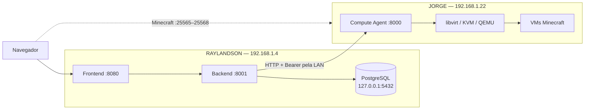
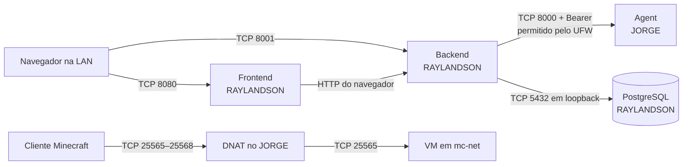
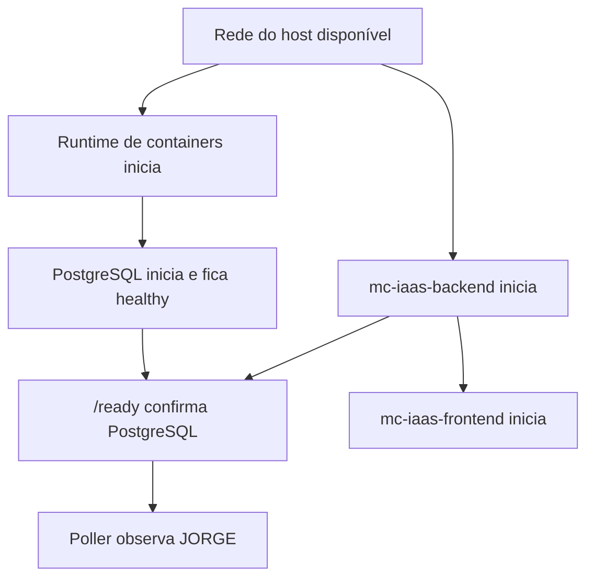

# Deploy do MC-IaaS

Este documento descreve como reproduzir em dois hosts a implantação do MC-IaaS validada no laboratório. Ele trata preparação, configuração, inicialização e diagnóstico dos serviços. Para a visão geral do projeto, consulte o [README principal](../README.md); para decisões e mecanismos internos, consulte a [arquitetura](ARCHITECTURE.md).

Este procedimento pressupõe administração consciente dos dois hosts. Ele não substitui hardening, gestão de secrets, backups e alta disponibilidade exigidos por uma implantação de produção.

Referências dos componentes:

- [Compute Agent](../compute-agent/README.md)
- [Backend do Control Plane](../control-plane/backend/README.md)
- [Frontend do Control Plane](../control-plane/frontend/README.md)

## 1. Topologia do laboratório

| Host | IP LAN | Papel | Serviços |
|---|---|---|---|
| RAYLANDSON | `192.168.1.4` | Control Plane | Frontend, backend FastAPI e PostgreSQL |
| JORGE | `192.168.1.22` | Compute Node | Compute Agent, libvirt, KVM/QEMU, storage, rede e VMs |



Portas da implantação:

| Porta | Host | Exposição esperada |
|---:|---|---|
| 8080/TCP | RAYLANDSON | Frontend acessível na LAN |
| 8001/TCP | RAYLANDSON | Backend acessível ao navegador na LAN |
| 5432/TCP | RAYLANDSON | PostgreSQL somente em `127.0.0.1` |
| 8000/TCP | JORGE | Agent restrito pelo UFW ao IP do RAYLANDSON |
| 25565–25568/TCP | JORGE | Entradas Minecraft dos quatro slots |

Os nomes, IPs e caminhos `/home/pc/...` usados adiante são específicos do laboratório. Adapte-os de forma consistente se os hosts forem outros.

## 2. Pré-requisitos gerais

Nos dois hosts são necessários Git, acesso administrativo por `sudo`, conectividade LAN, endereços estáveis e acesso SSH para manutenção. Antes do deploy, confirme que RAYLANDSON alcança `192.168.1.22` e que o navegador alcança `192.168.1.4`.

RAYLANDSON precisa de Python 3.12 ou superior, Node.js 22.12 ou superior, npm, Docker e Docker Compose. JORGE precisa de Linux com KVM/QEMU e libvirt, Python 3.11 ou superior, `cloud-localds` e os recursos locais descritos na seção seguinte.

O repositório não instala o sistema operacional, não define IP estático e não configura SSH. Também não contém um instalador completo de KVM/libvirt.

## 3. Preparação do JORGE

Obtenha o repositório em um caminho estável, por clone ou pela cópia já existente no laboratório:

```bash
git clone REPOSITORY_URL mc-iaas
cd mc-iaas/compute-agent
```

Substitua `REPOSITORY_URL` pela URL real do repositório.

Antes de iniciar o Agent, JORGE deve possuir:

- acesso funcional ao libvirt em `qemu:///system`;
- rede libvirt `mc-net` ativa ou definida, usando `10.50.0.0/24`;
- pools `mc-images`, `mc-instances` e `mc-volumes` definidos;
- imagem base Ubuntu 24.04 Minimal em `/srv/mc-iaas/storage/images/ubuntu-24.04-minimal-base.qcow2`;
- diretórios sob `/srv/mc-iaas` acessíveis ao usuário do Agent;
- `/srv/mc-iaas/scripts/apply-firewall.sh` e `/srv/mc-iaas/scripts/release-dhcp-lease.sh` instalados e executáveis;
- autorização `sudo -n` limitada aos helpers que o Agent precisa chamar;
- capacidade de executar VMs KVM e criar volumes nos pools.

O repositório contém apenas `infra/scripts/release-dhcp-lease.sh`. A definição completa de `mc-net`, os pools, a obtenção da imagem base, o helper `apply-firewall.sh` e as regras de `sudoers` são pré-requisitos externos. Não improvise esses recursos em um host que já executa outras VMs sem revisar sua configuração libvirt e de firewall.

Validações não destrutivas úteis:

```bash
virsh -c qemu:///system uri
virsh -c qemu:///system net-info mc-net
virsh -c qemu:///system pool-info mc-images
virsh -c qemu:///system pool-info mc-instances
virsh -c qemu:///system pool-info mc-volumes
test -r /srv/mc-iaas/storage/images/ubuntu-24.04-minimal-base.qcow2
```

## 4. Compute Agent

Crie o ambiente virtual e instale as dependências do Agent:

```bash
cd REPOSITORY_PATH/compute-agent
python3 -m venv .venv
.venv/bin/python -m pip install -e '.[compute,dev]'
```

Substitua `REPOSITORY_PATH` pelo caminho absoluto do checkout. Execute os comandos seguintes como o mesmo usuário que executará o Agent, para que ele consiga atravessar o diretório e ler o token:

Crie o arquivo de token sem colocar o valor na linha de comando ou no histórico do shell:

```bash
sudo install -d -o "$(id -un)" -g "$(id -gn)" -m 0700 /srv/mc-iaas/secrets
install -m 0600 /dev/null /srv/mc-iaas/secrets/agent-api-token
"${EDITOR:-vi}" /srv/mc-iaas/secrets/agent-api-token
```

O arquivo deve conter somente o token compartilhado, em uma linha. O processo precisa conseguir lê-lo. Não registre seu conteúdo em logs ou documentação.

Para o deploy distribuído, inicie o Agent com bind em todas as interfaces IPv4:

```bash
.venv/bin/python -m uvicorn jorge_agent.main:app \
  --host 0.0.0.0 \
  --port 8000
```

`127.0.0.1:8000` aceita somente conexões locais. `0.0.0.0:8000` aceita loopback e interfaces LAN; isso não concede acesso por si só, pois o UFW deve restringir quem alcança a porta. Bearer authentication continua obrigatória em todos os endpoints administrativos.

O `start.sh` versionado ativa `mc-net`, os três pools e o helper de firewall, inicia por `nohup` e grava PID/log, mas usa `127.0.0.1:8000`. Sem adaptação local, ele não fornece o bind LAN usado no laboratório.

Teste o endpoint público de liveness no próprio JORGE:

```bash
curl -fsS http://127.0.0.1:8000/health
```

Depois, a partir do RAYLANDSON:

```bash
curl -fsS http://192.168.1.22:8000/health
```

## 5. Firewall do JORGE

Restrinja o Agent ao Control Plane. No JORGE, a regra específica de laboratório é:



```bash
sudo ufw allow from 192.168.1.4 to 192.168.1.22 port 8000 proto tcp
sudo ufw status numbered
```

Revise as regras existentes antes de alterá-las. Não use `sudo ufw allow 8000`, porque isso autoriza origens além do RAYLANDSON. Não crie encaminhamento da porta 8000 no roteador e não a exponha à Internet.

O firewall reduz a superfície de rede, mas não substitui o token. O Agent exige Bearer mesmo quando a origem é permitida pelo UFW. As portas Minecraft têm política separada, determinada pelo alcance pretendido para os clientes e pelo helper do MC-IaaS; este documento não presume regras adicionais como obrigatórias.

## 6. Preparação do RAYLANDSON

O laboratório usa Ubuntu 22.04. A distribuição exata pode variar desde que suporte os requisitos da aplicação: Python 3.12+, Node.js 22.12+, npm, Docker e Docker Compose.

Confira as ferramentas antes de continuar:

```bash
python3.12 --version
node --version
npm --version
docker --version
docker compose version
```

Obtenha o repositório em `/home/pc/mc-iaas` para usar literalmente as units das seções 15 e 16. Em outro caminho ou usuário, adapte `User`, `Group`, `WorkingDirectory`, `EnvironmentFile` e `ExecStart`.

## 7. PostgreSQL

Prepare o ambiente do backend e suba o banco:

```bash
cd /home/pc/mc-iaas/control-plane/backend
cp -n .env.example .env
chmod 0600 .env
docker compose up -d postgres
docker compose ps
docker compose exec postgres pg_isready -U mc_iaas -d mc_iaas
```

O Compose usa PostgreSQL 16 Alpine, volume nomeado `postgres_data`, healthcheck com `pg_isready` e `restart: unless-stopped`. A publicação `127.0.0.1:5432:5432` impede acesso direto pela LAN; mantenha esse bind local.

O `compose.yml` e `.env.example` usam uma credencial fixa exclusiva para desenvolvimento. Ela permite levantar o ambiente de referência, mas não é uma senha segura para produção. Se a credencial for alterada em uma implantação nova, a senha do container e a `DATABASE_URL` do backend precisam permanecer consistentes. Alterar a variável depois que o volume PostgreSQL já foi inicializado não redefine automaticamente a senha armazenada no banco.

Não publique `5432:5432` sem o prefixo `127.0.0.1`.

## 8. Backend

No RAYLANDSON:

```bash
cd /home/pc/mc-iaas/control-plane/backend
python3.12 -m venv .venv
.venv/bin/python -m pip install -e '.[dev]'
.venv/bin/alembic upgrade head
.venv/bin/alembic current
```

O head versionado é `a17b92c6e401`, que adiciona a última observação de métricas e health dos Nodes. Não edite migrations já aplicadas; novas evoluções de schema devem usar novas revisions.

Configure o `.env` local sem reproduzir secrets em tickets ou documentação. Os campos centrais são:

```dotenv
DATABASE_URL=postgresql+asyncpg://mc_iaas:<password>@127.0.0.1:5432/mc_iaas
CORS_ORIGINS=["http://192.168.1.4:8080"]
MC_IAAS_AGENT_TOKEN_JORGE_AGENT=<token>

AGENT_CONNECT_TIMEOUT=5
AGENT_READ_TIMEOUT=30
NODE_POLL_INTERVAL=10
NODE_OFFLINE_THRESHOLD=30
NODE_MAX_BACKOFF=300
NODE_OBSERVATION_MAX_AGE=60
RECONCILIATION_INTERVAL=15
RECONCILIATION_RETRY_LIMIT=3
LOG_LEVEL=INFO
```

Os valores numéricos mostrados são os defaults atuais, não uma recomendação universal. `NODE_OFFLINE_THRESHOLD` conta observações consecutivas que falharam, não segundos. Reinicie o backend após alterar `.env`.

## 9. Secret do Agent no Backend

O cadastro do JORGE usa:

```text
credential_ref = jorge-agent
```

O `EnvironmentSecretProvider` converte a referência em:

```text
MC_IAAS_AGENT_TOKEN_JORGE_AGENT
```

O valor no `.env` do RAYLANDSON deve ser exatamente o mesmo do arquivo `/srv/mc-iaas/secrets/agent-api-token` no JORGE. O banco persiste somente `credential_ref`; o token é resolvido em memória para a chamada e nunca deve chegar ao frontend.

Proteja `.env` com permissões adequadas ao usuário do serviço. Não teste o token com comandos que o coloquem no histórico ou na lista de processos.

## 10. Inicialização manual do Backend

Antes de criar a unit systemd, valide o processo manualmente:

```bash
cd /home/pc/mc-iaas/control-plane/backend
.venv/bin/python -m uvicorn app.main:app \
  --host 0.0.0.0 \
  --port 8001
```

Em outro terminal no RAYLANDSON:

```bash
curl -fsS http://127.0.0.1:8001/health
curl -fsS http://127.0.0.1:8001/ready
```

Use um único processo/worker. NodePoller, OperationRunner e ReconciliationLoop são tarefas asyncio criadas no lifespan da aplicação e mantêm barreiras/agendas locais. O backend atual não foi projetado para várias cópias desses loops dentro de múltiplos workers.

## 11. Cadastro do Compute Node

Com backend e Agent acessíveis, cadastre JORGE uma única vez:

```bash
curl -fsS -X POST http://127.0.0.1:8001/api/v1/nodes \
  -H 'Content-Type: application/json' \
  -d '{
    "name": "JORGE",
    "endpoint": "http://192.168.1.22:8000",
    "credential_ref": "jorge-agent",
    "enabled": true
  }'
```

Depois consulte:

```bash
curl -fsS http://127.0.0.1:8001/api/v1/nodes
```

O cadastro retorna antes de várias observações futuras. Aguarde reachability `online`, health `healthy`, `observed_ready=true`, timestamps recentes e capacidade/métricas preenchidas. Se já existir um Node com esse nome, não repita o POST; consulte-o e corrija o cadastro conscientemente via PATCH usando seu UUID real.

## 12. Frontend

No RAYLANDSON:

```bash
cd /home/pc/mc-iaas/control-plane/frontend
npm ci
cp -n .env.example .env.local
```

Configure antes do build:

```dotenv
VITE_CONTROL_PLANE_MODE=http
VITE_CONTROL_PLANE_API_URL=http://192.168.1.4:8001
```

A URL deve apontar para a raiz do Control Plane, sem `/api/v1`. Ela é usada pelo navegador; `127.0.0.1` apontaria para a máquina de quem abriu a página, não necessariamente para RAYLANDSON.

Variáveis `VITE_*` são incorporadas ao bundle. Nunca coloque nelas token do Agent, senha do banco ou outro secret. Alterações exigem novo build.

## 13. Build do frontend

O `vite.config.ts` atual configura a entrada SSR, mas não fixa o preset `node-server`. A configuração compartilhada pode escolher outro destino por ambiente; por isso o deploy Node deve definir explicitamente:

```bash
cd /home/pc/mc-iaas/control-plane/frontend
NITRO_PRESET=node-server npm run build
HOST=0.0.0.0 PORT=8080 node .output/server/index.mjs
```

Teste em outro terminal:

```bash
curl -I http://127.0.0.1:8080
```

Se `.output/server/index.mjs` não existir, o build não gerou a saída Node esperada. Não mantenha simultaneamente o processo manual e o serviço systemd na porta 8080.

## 14. CORS

O navegador em `http://192.168.1.4:8080` chama o backend em outra porta, portanto outra origem. Inclua exatamente essa origem no `.env` do backend:

```dotenv
CORS_ORIGINS=["http://192.168.1.4:8080"]
```

Para desenvolvimento local, acrescente somente as origens usadas, como `http://localhost:8080` e `http://127.0.0.1:8080`. O formato é uma lista JSON. Reinicie o backend após a mudança.

Não use wildcard. CORS controla quais páginas o navegador deixa ler respostas; ele não autentica usuários nem protege chamadas feitas fora do navegador.

## 15. Serviço systemd do Backend

Crie `/etc/systemd/system/mc-iaas-backend.service` no RAYLANDSON com o conteúdo abaixo, adaptando usuário e caminhos quando necessário:

```systemd
[Unit]
Description=MC-IaaS Control Plane Backend
After=network-online.target
Wants=network-online.target

[Service]
Type=simple
User=pc
Group=pc
WorkingDirectory=/home/pc/mc-iaas/control-plane/backend
EnvironmentFile=/home/pc/mc-iaas/control-plane/backend/.env
ExecStart=/home/pc/mc-iaas/control-plane/backend/.venv/bin/uvicorn app.main:app --host 0.0.0.0 --port 8001
Restart=on-failure
RestartSec=5

[Install]
WantedBy=multi-user.target
```

Não adicione `Requires=docker.service`. Essa dependência fez a unit falhar no laboratório porque `docker.service` não existia com esse nome no host. A disponibilidade do PostgreSQL deve ser verificada por `/ready`; `Restart=on-failure` não substitui o diagnóstico do banco.

O comando não passa `--workers`; o default de um processo preserva a restrição do backend atual.

## 16. Serviço systemd do Frontend

Crie `/etc/systemd/system/mc-iaas-frontend.service`:

```systemd
[Unit]
Description=MC-IaaS Control Plane Frontend
After=network-online.target mc-iaas-backend.service
Wants=network-online.target

[Service]
Type=simple
User=pc
Group=pc
WorkingDirectory=/home/pc/mc-iaas/control-plane/frontend
Environment=HOST=0.0.0.0
Environment=PORT=8080
ExecStart=/usr/bin/node /home/pc/mc-iaas/control-plane/frontend/.output/server/index.mjs
Restart=on-failure
RestartSec=5

[Install]
WantedBy=multi-user.target
```

Confirme o executável com `which node`; se o resultado não for `/usr/bin/node`, use o caminho absoluto real em `ExecStart`. O usuário da unit deve conseguir ler o build e atravessar todos os diretórios pais.

`After=mc-iaas-backend.service` ordena o início, mas não espera `/ready`. O frontend pode subir enquanto o banco ainda inicializa; a validação posterior deve conferir cada camada.

## 17. Habilitar systemd

Depois de revisar as duas units:

```bash
sudo systemctl daemon-reload
sudo systemctl enable --now mc-iaas-backend
sudo systemctl enable --now mc-iaas-frontend
```

Verifique estado e logs:

```bash
systemctl status mc-iaas-backend --no-pager
systemctl status mc-iaas-frontend --no-pager
journalctl -u mc-iaas-backend -f
journalctl -u mc-iaas-frontend -f
```

Encerre `journalctl -f` com `Ctrl+C`. Um serviço `active` comprova que o processo está vivo; use `/ready`, HTTP do frontend e o estado do Node para validar suas dependências.

## 18. Inicialização automática do PostgreSQL

O container possui `restart: unless-stopped`, mas essa política só funciona após o runtime de containers iniciar. Descubra e valide o mecanismo pelo qual a instalação de Docker do RAYLANDSON inicia no boot; não presuma que existe uma unit chamada `docker.service`.



As setas representam a ordem operacional que deve ser validada, não dependências systemd completas. A unit do backend não declara dependência de uma unit Docker específica; por isso `/ready` é a confirmação efetiva de que banco e backend convergiram após o boot.

Após um boot, confira:

```bash
cd /home/pc/mc-iaas/control-plane/backend
docker compose ps
docker compose exec postgres pg_isready -U mc_iaas -d mc_iaas
```

Se o container tiver sido parado manualmente antes do reboot, `unless-stopped` preserva essa decisão e não o reinicia automaticamente.

## 19. Validação após reboot

Faça esse teste somente em uma janela em que reiniciar RAYLANDSON seja aceitável. Confirme antes que arquivos `.env`, build, migrations e units estejam prontos:

```bash
sudo reboot
```

Após o host voltar:

```bash
systemctl status mc-iaas-backend mc-iaas-frontend --no-pager
cd /home/pc/mc-iaas/control-plane/backend
docker compose ps
curl -fsS http://127.0.0.1:8001/ready
curl -I http://127.0.0.1:8080
```

Abra `http://192.168.1.4:8080` em outro equipamento. Confirme que JORGE aparece online, healthy e ready, com timestamps atuais. O teste de reboot do laboratório cobriu RAYLANDSON; a inicialização automática do Agent no JORGE depende do mecanismo local, que não possui unit versionada no repositório.

## 20. Teste distribuído final

Com todas as sondagens anteriores aprovadas:

1. Abra o dashboard em `http://192.168.1.4:8080`.
2. Crie uma instância com nome novo e aceite da EULA.
3. Aguarde a Operation CREATE terminar e a instância aparecer `stopped`.
4. Solicite START e aguarde confirmação.
5. Confira slot, IP interno e porta externa atribuídos.
6. Aguarde o status Minecraft `online`; VM `running` pode preceder o fim do bootstrap.
7. Conecte um cliente Minecraft compatível a `192.168.1.22:<porta-externa>`.
8. Solicite STOP e confirme que o runtime foi liberado.
9. Com a VM parada, solicite DELETE; o fluxo do Control Plane preserva o volume de dados.

Esse percurso valida frontend, CORS, backend, PostgreSQL, Scheduler, OperationRunner, LAN, Bearer, Agent, libvirt/KVM, storage, rede da VM e servidor Minecraft. Ele cria e remove recursos reais; execute-o somente com um nome de teste e dados dispensáveis.

## 21. Verificação de portas

No JORGE:

```bash
ss -ltnp | grep ':8000'
```

O endereço deve incluir `0.0.0.0:8000` no deploy LAN. A ausência indica Agent parado; `127.0.0.1:8000` indica bind apenas local.

No RAYLANDSON:

```bash
ss -ltnp | grep ':8001'
ss -ltnp | grep ':8080'
ss -ltnp | grep ':5432'
```

Backend e frontend devem aparecer em `0.0.0.0`; PostgreSQL deve aparecer apenas em `127.0.0.1`. `ss -p` pode exigir privilégios para mostrar o processo proprietário.

## 22. Logs

No RAYLANDSON:

```bash
journalctl -u mc-iaas-backend --since today --no-pager
journalctl -u mc-iaas-frontend --since today --no-pager
cd /home/pc/mc-iaas/control-plane/backend
docker compose logs postgres
```

No JORGE, quando o Agent foi iniciado pelo `start.sh`:

```bash
tail -f /srv/mc-iaas/logs/jorge-agent.log
```

Para estado do hypervisor, prefira consultas não destrutivas como `virsh -c qemu:///system list --all`, `net-info` e `pool-info`. Logs podem conter nomes, caminhos e detalhes operacionais: não os publique sem revisão e nunca acrescente tokens ou conteúdos de `.env` aos comandos de diagnóstico.

## 23. Atualização da aplicação

Antes de atualizar, registre o commit atualmente implantado, leia as migrations novas e escolha uma janela compatível com interrupções. Faça pull apenas com a árvore de deploy limpa:

```bash
cd /home/pc/mc-iaas
git status --short
git pull --ff-only
```

Atualize o backend:

```bash
cd /home/pc/mc-iaas/control-plane/backend
.venv/bin/python -m pip install -e '.[dev]'
.venv/bin/alembic upgrade head
sudo systemctl restart mc-iaas-backend
curl -fsS http://127.0.0.1:8001/ready
```

Atualize o frontend:

```bash
cd /home/pc/mc-iaas/control-plane/frontend
npm ci
NITRO_PRESET=node-server npm run build
sudo systemctl restart mc-iaas-frontend
curl -I http://127.0.0.1:8080
```

No JORGE, revise primeiro alterações em lifecycle, rede e schema de metadata. Reinstale dependências se necessário e reinicie o Agent pelo mecanismo efetivamente usado no host. `stop.sh` para apenas o processo e não para VMs; isso não garante que toda versão nova possa ser trocada com VMs ativas. Se a compatibilidade da atualização não estiver documentada, pare workloads de forma controlada pelo Control Plane antes da manutenção e valide invariantes ao retornar.

## 24. Rollback de deploy

Rollback básico significa implantar um commit conhecido e compatível, reinstalar dependências, reconstruir o frontend e reiniciar os serviços. Faça isso somente com working tree limpa e sem descartar mudanças locais:

```bash
git switch --detach KNOWN_GOOD_COMMIT
```

Substitua `KNOWN_GOOD_COMMIT` por uma tag ou hash previamente validado.

Repita então os passos de instalação/build da seção anterior. Em um fluxo mantido, prefira uma tag ou branch de release conhecida a um hash não registrado.

Não execute downgrade Alembic automaticamente. Código antigo pode ser incompatível com o schema atual, e uma migration reversa pode remover dados. Trate rollback de banco separadamente, após conferir se a revision suporta downgrade seguro e se existe backup adequado.

## 25. Troubleshooting

### Backend não sobe: `docker.service` not found

No laboratório, uma unit com `Requires=docker.service` falhou porque essa unit não existia no host. Remova a dependência da unit do backend, execute `systemctl daemon-reload` e valide PostgreSQL por `docker compose ps` e `/ready`. Descubra separadamente como a instalação local de Docker inicia.

### Frontend encerra imediatamente

Confirme `systemctl status`, `journalctl` e `ss -ltnp`. Verifique se `.output/server/index.mjs` existe, se o build usou `NITRO_PRESET=node-server`, se `ExecStart` aponta para o `node` correto e se outro processo já ocupa 8080.

### Backend não alcança o Agent

Do RAYLANDSON, teste `curl -fsS http://192.168.1.22:8000/health`. No JORGE, confira bind `0.0.0.0`, processo, UFW e IP. Confirme que o cadastro usa `http://192.168.1.22:8000`, `credential_ref=jorge-agent`, e que ambos os hosts possuem o mesmo token sem espaços extras.

### Node offline

Confira Agent, LAN, UFW, endpoint e token. `/health` ser público e responder não comprova Bearer válido; erros de autenticação aparecem nas observações do backend. Considere também o intervalo/backoff do NodePoller antes de concluir que a correção não funcionou.

### Frontend abre, mas não carrega dados

Confirme `VITE_CONTROL_PLANE_API_URL=http://192.168.1.4:8001`, refaça o build após mudanças, valide `CORS_ORIGINS`, teste backend na porta 8001 a partir do navegador e examine o console/rede do navegador. Não use `127.0.0.1` no bundle acessado remotamente.

### PostgreSQL indisponível

Use:

```bash
cd /home/pc/mc-iaas/control-plane/backend
docker compose ps
docker compose logs postgres
curl -fsS http://127.0.0.1:8001/ready
```

Confira consistência entre a credencial do banco inicializado e `DATABASE_URL`. Não remova o volume como tentativa inicial: ele contém o estado durável do Control Plane.

### Orphan instances detected

O Agent observou uma VM que não corresponde a uma Instance conhecida no banco. O Control Plane registra apenas a contagem e não adota nem remove o recurso. Compare inventário do dashboard com `virsh list --all` e metadata local, identifique a origem e decida manualmente. Não apague domínio ou volume antes de confirmar propriedade e necessidade dos dados.

## 26. Segurança operacional

- Nunca versione `.env`, tokens, senhas ou conteúdo de `/srv/mc-iaas/secrets`.
- Não coloque secrets em `VITE_*`; eles ficam públicos no bundle.
- Restrinja TCP 8000 no UFW ao RAYLANDSON e não publique essa porta na Internet.
- Mantenha PostgreSQL em `127.0.0.1:5432`.
- Mantenha RCON 25575 sem encaminhamento público.
- Proteja o token do Agent e o `.env` do backend com permissões mínimas.
- Evite tokens em argumentos, histórico, URLs e logs.
- Use uma credencial distinta por Compute Node se a implantação crescer.
- Planeje TLS/mTLS e autenticação/RBAC antes de exposição fora da LAN controlada.

O frontend e a API do Control Plane não possuem autenticação de usuário no MVP. Não trate a restrição CORS como controle de acesso.

## 27. Checklist de deploy

- [ ] JORGE está acessível pela LAN.
- [ ] `mc-net`, pools, imagem base e helpers existem no JORGE.
- [ ] Agent está ativo em `0.0.0.0:8000`.
- [ ] UFW permite TCP 8000 somente a partir de `192.168.1.4`.
- [ ] PostgreSQL está healthy e limitado a loopback.
- [ ] Migrations estão em `a17b92c6e401` ou no head atual do checkout.
- [ ] Backend responde `/ready`.
- [ ] JORGE aparece online, healthy e ready.
- [ ] Frontend responde em 8080 e carrega dados reais.
- [ ] Units backend/frontend estão habilitadas.
- [ ] Inicialização após reboot foi validada.
- [ ] CREATE terminou em `stopped`.
- [ ] START atribuiu runtime e Minecraft ficou online.
- [ ] STOP liberou o runtime.
- [ ] DELETE terminou com dados preservados.

## 28. O que não é automatizado pelo repositório

Não existe um comando único de provisionamento. Permanecem externos ou locais ao laboratório:

- instalação do sistema operacional, Git, Python, Node, Docker, KVM/QEMU e libvirt;
- endereços IP estáveis, SSH e roteamento LAN;
- definição completa da rede libvirt `mc-net`;
- definição e backing paths dos três pools;
- obtenção e proteção da imagem base;
- instalação do helper `apply-firewall.sh` e das regras limitadas de `sudoers`;
- regras UFW do Agent e política das portas Minecraft;
- criação das units systemd de backend e frontend;
- mecanismo de inicialização do Agent no JORGE;
- gestão de tokens, senhas e backups.

`start.sh` ativa recursos já definidos; ele não os cria integralmente e usa bind local. O script `stop-final.sh` para VMs e desativa infraestrutura, portanto não faz parte do caminho normal de inicialização nem de uma validação não destrutiva.

## 29. Diferença entre laboratório e produção

| Laboratório validado | Exigência típica de produção |
|---|---|
| Dois hosts e um Compute Node | Múltiplos Nodes testados e capacidade redundante |
| LAN com HTTP | TLS/mTLS e segmentação de rede |
| IPs fixos conhecidos | Descoberta/configuração gerenciada de endpoints |
| Bearer compartilhado | Secret manager, rotação e credenciais por Node |
| Dashboard sem login | Autenticação de usuário e RBAC |
| PostgreSQL local em container | Backup, recuperação testada e alta disponibilidade conforme necessidade |
| Storage local | Storage compartilhado ou estratégia explícita de replicação |
| Últimas métricas | Monitoramento histórico e alertas |
| Placement sticky sem failover | Política testada de failover/migração |

O procedimento deste documento reproduz o laboratório funcional. Ele fornece uma base técnica verificável, mas não transforma o MVP em uma plataforma pronta para exposição pública.
