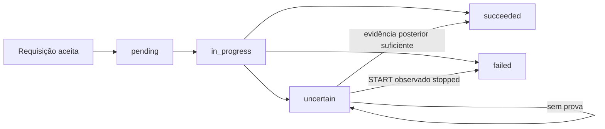
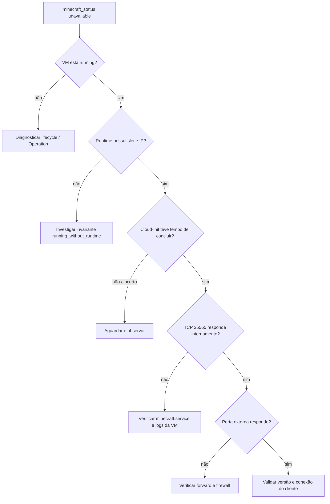
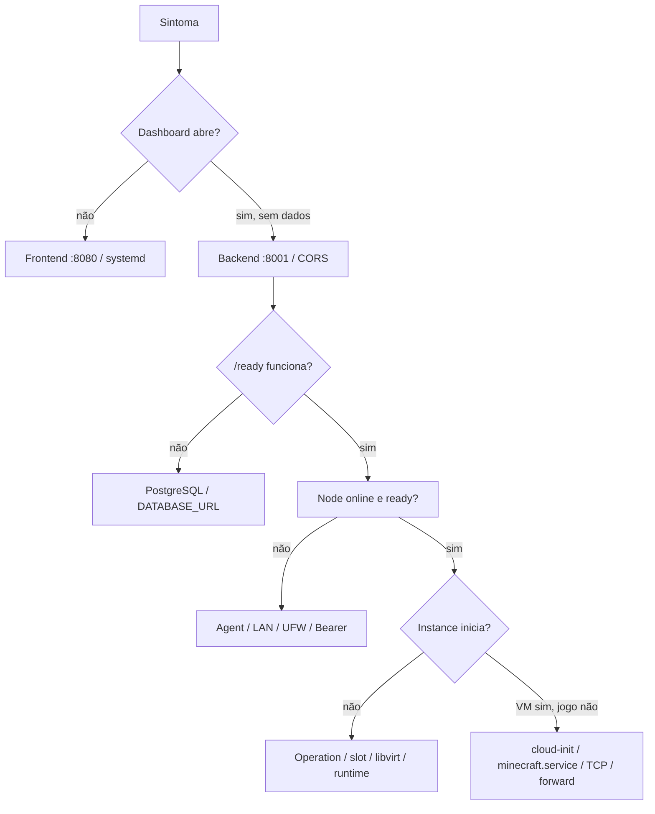

# Operação do MC-IaaS

Este documento pressupõe que o MC-IaaS já está implantado e funcional. Ele orienta operação diária, observação, diagnóstico e resposta a incidentes. Instalação e configuração pertencem ao [guia de deploy](DEPLOYMENT.md); mecanismos internos e garantias pertencem à [arquitetura](ARCHITECTURE.md).

Referências complementares:

- [README principal](../README.md)
- [Compute Agent](../compute-agent/README.md)
- [Backend do Control Plane](../control-plane/backend/README.md)
- [Frontend do Control Plane](../control-plane/frontend/README.md)

Os comandos deste runbook são de leitura ou reinício controlado, salvo quando uma seção identifica explicitamente uma ação destrutiva. Preserve o estado observado antes de agir e execute lifecycle preferencialmente pelo Control Plane.

## 1. Visão operacional

O caminho de uma solicitação atravessa camadas independentes:

```text
Usuário
  → Frontend no RAYLANDSON
  → Control Plane no RAYLANDSON
  → PostgreSQL local
  → Compute Agent no JORGE
  → libvirt / KVM / QEMU
  → VM
  → Minecraft
```

Uma página aberta não comprova que o banco está disponível. Uma VM `running` não comprova que Minecraft terminou o bootstrap. Um Agent acessível não comprova que o Node está `ready`. Diagnostique de fora para dentro e identifique a primeira camada que não atende seu contrato.

O Control Plane preserva a intenção global. O Agent é a autoridade operacional do Compute Node. O libvirt representa a realidade da VM. Não substitua um estado `unknown` por `stopped` apenas porque uma chamada falhou.

## 2. Estado saudável esperado

| Componente | Estado esperado | Verificação principal |
|---|---|---|
| Frontend | Responde HTTP e renderiza dados reais | Navegador ou `curl -I` em 8080 |
| Backend | Processo vivo e banco acessível | `/health` e `/ready` em 8001 |
| PostgreSQL | Container healthy | `docker compose ps` e `/ready` |
| Agent | Liveness local e remoto | `/health` em 8000 |
| JORGE | `online`, `healthy`, `ready=true` | Nodes no dashboard ou `/api/v1/nodes` |
| Capacidade | Máximo 4 e contagens coerentes | Capacity do Node |
| Instances estáveis | Desired e observed convergentes | Tela/API de Instances |
| Minecraft ativo | VM `running`, runtime presente e status `online` | Detalhe da Instance |
| Operations | Sem pendências antigas ou incertezas ignoradas | Activity e `/api/v1/operations` |

“Healthy” é um resultado composto. Se uma dimensão estiver ausente, vencida ou inconsistente, investigue antes de criar nova carga.

## 3. Checklist rápido de saúde

No RAYLANDSON:

```bash
systemctl status mc-iaas-backend mc-iaas-frontend --no-pager
cd ~/mc-iaas/control-plane/backend
docker compose ps
curl -fsS http://127.0.0.1:8001/health
curl -fsS http://127.0.0.1:8001/ready
curl -fsS http://127.0.0.1:8001/api/v1/nodes
curl -I http://127.0.0.1:8080
```

No JORGE:

```bash
curl -fsS http://127.0.0.1:8000/health
```

Do RAYLANDSON, confirme também a travessia LAN:

```bash
curl -fsS http://192.168.1.22:8000/health
```

Esses probes públicos não validam o Bearer. O Node ficar online e receber snapshot comprova que backend, referência de credencial e autenticação do Agent funcionaram juntos.

## 4. Dashboard

| Tela | Uso operacional |
|---|---|
| Overview | Ver estado agregado, Nodes, workloads, capacidade, métricas e condições atuais |
| Nodes | Examinar reachability, health, readiness, timestamps, slots e componentes do JORGE |
| Instances | Criar workloads, executar lifecycle e comparar estados/runtime |
| Monitoring | Observar distribuição de saúde/estado, métricas atuais e condições abertas |
| Activity | Correlacionar solicitações, Operations, mudanças observadas e reconciliação |

As consultas ativas em modo HTTP se atualizam periodicamente. Ainda assim, confirme timestamps e Operations antes de assumir que um cartão representa o instante atual. Settings mantém preferências locais e não reconfigura workers ou Agent.

## 5. Overview

`infrastructure_status` pode ser:

- `operational`: existe Node disponível e não há condição aberta ou health divergente;
- `degraded`: existe capacidade observável, mas há Node indisponível, health não saudável ou condição aberta;
- `down`: nenhum Node possui reachability recente utilizável.

Overview mostra totais de Nodes e Instances, workloads running/stopped, slots totais/ocupados/disponíveis, condições críticas e métricas agregadas. CPU é média simples entre Nodes elegíveis; memória e storage somam pares válidos de usado/total.

Interprete valores com cuidado:

| Exibição | Interpretação |
|---|---|
| `0` | Valor foi observado e é zero |
| `null`, traço ou indisponível | Não há dado válido para a projeção |
| Timestamp antigo | Último valor conhecido, não leitura atual |

Capacidade pode preservar o último valor de Node offline. Ela não equivale necessariamente a capacidade escalonável naquele momento.

## 6. Nodes

`reachability` descreve comunicação: `online`, `offline` ou `unknown`. `observed_health` descreve o último resultado agregado: `healthy`, `degraded`, `unhealthy` ou `unknown`. `observed_ready` informa se o Agent considera seguro anunciar capacidade.

`online` não implica `ready`. O poller pode alcançar o processo enquanto libvirt, rede, storage ou invariantes tornam o Node inadequado para START.

Timestamps têm papéis diferentes:

- `last_seen_at`: último snapshot recebido do Agent;
- `last_observed_at`: última observação completa de health/capacidade, usada por Scheduler;
- `metrics_observed_at`: última atualização válida de métricas.

Capacity possui quatro contagens: máximo estrutural, VMs ativas, slots fisicamente ocupados e slots anunciados como disponíveis. Divergência entre VMs ativas e slots ocupados é sinal para examinar invariantes.

## 7. Instances

| Campo | Pergunta respondida |
|---|---|
| `desired_state` | O que o Control Plane pretende manter? |
| `observed_state` | O que Agent/libvirt confirmaram por último? |
| `display_state` | Como disponibilidade e Operation ativa devem aparecer na UI? |
| `runtime` | Qual slot, IP e porta foram observados? |
| `minecraft_status` | A porta Minecraft foi alcançada pelo probe? |
| `last_error` | Existe condição persistida, especialmente da reconciliação? |
| `active_operation` | Há mutação pendente, em execução ou incerta? |

Durante START é normal ver `desired=running`, `observed=stopped` e `display=starting`. Node indisponível pode produzir `display=unavailable` sem apagar o estado observado. Uma Operation incerta produz `display=uncertain`.

Use os campos em conjunto. `runtime=null` é esperado para stopped; em running é indício de inconsistência.

## 8. CREATE

Pelo dashboard, informe nome, memória, uma vCPU, versão Minecraft, `vm_username` e aceite explícito da EULA. O Scheduler escolhe o Node. O Agent cria discos, cloud-init, domínio, metadata e secrets.

Resultado estável esperado:

```text
desired_state  = stopped
observed_state = stopped
runtime        = null
```

CREATE não ocupa slot. Pode ser aceito mesmo quando `available_slots=0`, desde que exista Node utilizável.

Se falhar, examine a Operation e Activity. Causas conhecidas incluem nome já existente ou tombstonado, payload/EULA inválidos, Node sem observação recente, autenticação do Agent, versão sem suporte e falha local de storage/libvirt. Não repita CREATE com o mesmo nome se houver resultado incerto ou workload órfã.

## 9. START

START primeiro persiste `desired=running` e uma Operation. O OperationRunner a envia ao Node já atribuído. O Agent escolhe localmente um slot livre, configura NIC, DHCP e port-forward e inicia o domínio.

Resultado estável esperado:

```text
desired_state  = running
observed_state = running
runtime        = { slot, ip, external_port }
```

No primeiro boot, cloud-init ainda pode estar instalando Java e Minecraft depois que libvirt reporta `running`. Aguarde `minecraft_status=online` antes de testar o cliente. Se START falhar, não tente outro Node: o placement é sticky e não há failover.

## 10. RESTART

RESTART exige Instance observada `running` e `desired=running`. O Agent reinicia o domínio preservando slot, IP, NIC e porta.

Esse comando exige cuidado especial em caso de timeout. Observar a VM `running` depois não prova que ocorreu reinício, pois ela já estava running antes. O Reconciler mantém RESTART incerto sem evidência suficiente. Não reenvie para “garantir”; investigue eventos, uptime/comportamento da workload e logs disponíveis.

## 11. STOP

STOP para o domínio e libera lease, reserva DHCP, forward e NIC. Overlay, volume de dados, metadata e configuração são preservados.

Resultado estável esperado:

```text
desired_state  = stopped
observed_state = stopped
runtime        = null
```

O slot retorna à capacidade após confirmação/observação. STOP de uma Instance já stopped é aceito de forma idempotente pelo Control Plane, desde que não exista outra mutação ativa.

## 12. DELETE

DELETE pelo Control Plane exige Instance stopped e não executa STOP implícito. O Agent remove domínio, overlay, cloud-init e secret da instância. O Control Plane sempre envia `delete_data=false`, preservando o volume do mundo e metadata marcada como deletada.

O registro global vira tombstone (`deleted_at`), deixa de aparecer nas listagens normais e mantém Operations/Events. O índice de nomes continua reservando o nome; não há restore automático.

A API direta do Agent aceita `delete_data=true`, que remove também o volume persistente e metadata. Essa é uma ação destrutiva e não faz parte da operação normal. Não a use como atalho para resolver inconsistência.

## 13. Capacidade e slots

| Campo | Significado |
|---|---|
| `max_active_instances` | Limite estrutural: 4 |
| `active_instances` | Domínios observados running ou paused |
| `occupied_runtime_slots` | Slots ocupados por IP, lease ou forward |
| `available_slots` | Slots anunciados ao Scheduler; vira 0 se Node não estiver ready |

VMs paradas não ocupam runtime. CREATE pode preparar várias VMs stopped; START exige capacidade no Node sticky. Não calcule slots livres apenas como `4 - active_instances`: resíduos de runtime podem ocupar slots sem VM ativa.

## 14. Runtime

| Slot | IP interno | Porta no JORGE | Destino na VM |
|---:|---|---:|---:|
| 1 | `10.50.0.10` | 25565 | 25565 |
| 2 | `10.50.0.11` | 25566 | 25565 |
| 3 | `10.50.0.12` | 25567 | 25565 |
| 4 | `10.50.0.13` | 25568 | 25565 |

O Agent escolhe o primeiro slot sem IP reservado/leased e sem porta encaminhada. STOP libera o runtime. Como o vínculo é temporário, outro START da mesma Instance pode obter slot, IP e porta diferentes.

Use a porta exibida na observação atual. Não preserve manualmente um endereço antigo em scripts de cliente.

## 15. Minecraft status

| Estado | Significado implementado |
|---|---|
| `online` | VM running, runtime conhecido e conexão TCP a 25565 aceita |
| `offline` | VM stopped |
| `unavailable` | VM running, mas a conexão TCP falhou/expirou |
| `unknown` | Estado, IP ou evidência insuficiente |

O probe usa TCP com timeout de um segundo. Ele não valida handshake do protocolo Minecraft, login de jogador nem RCON. Assim, `online` comprova porta aberta; a validação final continua sendo a conexão de um cliente compatível.

## 16. Operations



| Estado | Significado | Ação do operador |
|---|---|---|
| `pending` | Persistida, aguardando runner | Aguarde; confira Node e idade se persistir |
| `in_progress` | Reivindicada e potencialmente enviada | Aguarde; não envie outra mutação |
| `succeeded` | Resultado confirmado | Confira observed/runtime e status da workload |
| `failed` | Recusa ou falha conhecida | Leia erro sanitizado e Events; corrija a causa |
| `uncertain` | Pode haver efeito remoto sem confirmação | Não reenvie; preserve evidência e siga a seção 17 |

Consulte todas ou filtre por estado:

```bash
curl -fsS http://127.0.0.1:8001/api/v1/operations
curl -fsS 'http://127.0.0.1:8001/api/v1/operations?status=uncertain'
```

## 17. Operation uncertain

Considere o cenário: o runner envia START, o Agent inicia a VM, mas a resposta HTTP se perde. O Control Plane não pode provar sucesso nem falha e marca a Operation `uncertain`.

Timeout não significa falha confirmada. O operador não deve presumir nenhum resultado.

Procedimento:

1. Não repita a mutação.
2. Aguarde o próximo polling.
3. Observe Instance, runtime e timestamp da observação.
4. Confirme reachability/readiness do Node.
5. Consulte Events ligados à Instance/Operation.
6. Se necessário, consulte snapshot do Agent e estado no libvirt.
7. Só execute ação manual quando houver evidência da camada e do efeito real.

O Reconciler pode resolver automaticamente alguns casos com inventário posterior confiável. RESTART é a exceção importante: `running` não prova que reiniciou.

## 18. Desired vs observed divergente

| Desired | Observed | Interpretação operacional |
|---|---|---|
| `running` | `stopped` | START pendente, falha da VM ou divergência reconciliável |
| `stopped` | `running` | STOP pendente ou divergência reconciliável |
| `absent` | `stopped` | DELETE pode ser reconciliado preservando dados |
| `running` | `unknown` | Sem evidência; aguardar observação |
| `running` | `missing` | Recurso esperado ausente; não recriar automaticamente |
| `absent` | `running` | Situação insegura; não encadear STOP/DELETE automaticamente |

Divergência durante uma Operation é normal e pode ser transitória. Avalie `active_operation`, `display_state`, `last_observed_at` e Events antes de intervir. O Reconciler só corrige combinações previstas e com observação recente.

## 19. Node offline

Sintomas: `reachability=offline`, `last_seen_at` antigo, falhas consecutivas e `last_error` sanitizado. Métricas e estados anteriores permanecem no banco; não os trate como leituras atuais.

Diagnóstico em ordem:

1. No JORGE, teste `http://127.0.0.1:8000/health`.
2. No RAYLANDSON, teste `http://192.168.1.22:8000/health`.
3. Confira processo e bind `0.0.0.0:8000` no JORGE.
4. Confira LAN e UFW restrito ao RAYLANDSON.
5. Confira endpoint cadastrado no Control Plane.
6. Confira `credential_ref=jorge-agent` e o secret correspondente.
7. Leia logs do backend e do Agent.
8. Após corrigir, aguarde o poller; o backoff pode atrasar a próxima tentativa.

O Control Plane não deve mudar `desired_state` porque o Node ficou offline. Ausência de comunicação não comprova estado das VMs.

## 20. Node not ready

Um Node pode estar online e `ready=false`. Nesse caso o processo respondeu, mas o Agent encontrou condição que impede anunciar capacidade.

Examine health de `libvirt`, `network`, `storage` e `invariants`, além dos detalhes de invariantes. Possíveis causas confirmadas incluem rede/pool inativo, imagem base ausente ou gravável, helper ausente, relação domínio/runtime inconsistente e exposição de RCON.

Não force START enquanto `ready=false`. Corrija a condição local e deixe o próximo snapshot renovar `last_observed_at`.

## 21. Orphan instances

Uma órfã é workload gerenciada observada pelo Agent sem Instance correspondente no banco do Control Plane. Isso ocorreu no laboratório ao combinar banco novo com VMs antigas.

O poller registra Node e quantidade em log sanitizado. Ele não persiste nomes remotos no Event, não adota e não remove a VM.

Procedimento seguro:

1. Liste Instances no Control Plane.
2. Liste Instances no Agent ou libvirt usando leitura autenticada/`virsh`.
3. Compare nomes e confirme metadata local.
4. Identifique se a VM contém dados necessários e de qual implantação veio.
5. Decida manualmente entre preservar, documentar ou remover por um procedimento aprovado.

Nunca automatize exclusão de órfãos apenas pela ausência no banco.

## 22. Instance missing

É o inverso: o Control Plane conhece a Instance, mas um inventário completo e confiável não encontra a VM no Agent atribuído. O estado observado vira `missing` e o runtime observado é limpo.

Não há recriação automática para `desired=running` ou `stopped`. Recriar pelo mesmo nome poderia conflitar com storage, metadata ou uma execução em outro contexto. Confirme Node correto, inventário libvirt, metadata e histórico de Operations antes de decidir.

## 23. Minecraft unavailable



Comece pela Instance e Operation. Confirme `running`, runtime, IP e porta. Primeiro boot pode levar tempo; não use RESTART repetido durante cloud-init. Depois confira health/invariantes de rede e o forward do slot.

O repositório cria `minecraft.service` dentro da VM, mas o Control Plane não entrega credenciais de login geradas. Inspecione serviço e logs internos apenas se houver acesso administrativo obtido e preservado por outro procedimento autorizado. RCON também depende do servidor já estar disponível e não substitui diagnóstico de bootstrap.

## 24. Runtime residual

Runtime residual ocorre quando a VM está stopped, mas ainda há NIC, reserva DHCP, lease ou forward. Isso pode reduzir `available_slots` sem aumentar `active_instances`.

O Agent executa recovery no startup e pelo endpoint administrativo `/node/reconcile`. Para VMs paradas, remove resíduos considerados seguros usando os mesmos locks do lifecycle. Se a limpeza falhar ou a invariante continuar aberta, preserve logs e examine cada recurso; não edite `port-forwards.conf` ou XML libvirt às cegas.

VM ativa sem runtime é o caso oposto e não é reconstruído automaticamente.

## 25. Invariants

Invariantes verificam relações entre recursos, não apenas disponibilidade isolada. Elas podem deixar health `unhealthy`, `ready=false` e capacidade anunciada igual a zero.

Exemplos confirmados:

- `mc-net` e pools necessários ativos;
- imagem base presente e sem bits de escrita;
- helpers obrigatórios presentes;
- domínio e metadata coerentes;
- VM ativa com runtime e VM parada sem runtime;
- slots/endereços/portas sem colisão e limite local respeitado;
- nenhum forward com destino à porta RCON 25575.

Não ignore uma invariante para “liberar” o Scheduler. Ela descreve uma relação que precisa ser entendida e restaurada.

## 26. Monitoring

Monitoring apresenta CPU, memória, storage MC-IaaS, uptime do processo Agent, capacity, health, distribuições e condições atuais. Métricas de Node vêm da última observação persistida; root disk e métricas detalhadas por Instance não são integralmente projetados pelo backend HTTP atual.

Não há histórico de CPU, memória ou storage:

```json
{
  "historical_metrics_available": false,
  "timeseries": []
}
```

Uma linha gráfica no modo mock não constitui telemetria do laboratório. Para incidentes, registre manualmente timestamps e valores relevantes antes que a próxima observação os substitua.

## 27. Activity / Events

Events persistem solicitações de lifecycle, placement, transições de Operations, reachability, mudanças observadas e decisões de reconciliação. Use IDs e timestamps para reconstruir a ordem dos fatos.

Mensagens vêm de catálogo fixo e não incluem body remoto, exceção bruta ou secrets; detalhes JSON internos não são expostos pela API. Ainda assim, nomes, UUIDs e horários são dados operacionais e merecem revisão antes de publicação.

Events são histórico de controle. Eles não armazenam amostras históricas de CPU/memória/storage.

## 28. Logs do Backend

Acompanhe ou leia as últimas linhas:

```bash
journalctl -u mc-iaas-backend -f
journalctl -u mc-iaas-backend -n 100 --no-pager
```

Procure famílias `node.poll`, `operation`, `reconciliation` e `node.orphan_instance.detected`, além de erros HTTP. O código evita registrar bodies e credenciais deliberadamente; não acrescente headers ou `.env` ao material de incidente.

## 29. Logs do Frontend

```bash
journalctl -u mc-iaas-frontend -f
journalctl -u mc-iaas-frontend -n 100 --no-pager
```

Esses logs explicam falhas do servidor Nitro/Node. Se a página abre, mas os dados falham, confirme também requisições no navegador, CORS e API do backend. Reiniciar apenas o frontend não corrige banco ou Agent.

## 30. PostgreSQL

No RAYLANDSON:

```bash
cd ~/mc-iaas/control-plane/backend
docker compose ps
docker compose logs postgres
curl -fsS http://127.0.0.1:8001/ready
```

`/health` comprova o processo backend; `/ready` testa a conexão com PostgreSQL. Não use SQL direto como primeira resposta operacional e não remova o volume para tentar corrigir readiness: ele contém intenção, Operations e Events.

## 31. Logs e diagnóstico do Agent

O repositório não define unit systemd para o Agent. No launcher versionado, o processo grava PID em `/srv/mc-iaas/run/jorge-agent.pid` e stdout/stderr em `/srv/mc-iaas/logs/jorge-agent.log`.

```bash
cat /srv/mc-iaas/run/jorge-agent.pid
curl -fsS http://127.0.0.1:8000/health
tail -n 100 /srv/mc-iaas/logs/jorge-agent.log
```

Quando o snapshot autenticado for realmente necessário, no próprio JORGE:

```bash
TOKEN="$(sudo cat /srv/mc-iaas/secrets/agent-api-token)"
curl -fsS \
  -H "Authorization: Bearer ${TOKEN}" \
  http://127.0.0.1:8000/node/snapshot
unset TOKEN
```

Não use token em query string, não execute esse bloco com tracing (`set -x`) e não cole a saída sem revisar erros e nomes operacionais. Na implantação real com outro gerenciador de processo, use os logs e status desse mecanismo sem inventar um nome de unit.

## 32. libvirt / virsh

Consultas seguras no JORGE:

```bash
sudo virsh -c qemu:///system list --all
sudo virsh -c qemu:///system domstate INSTANCE_NAME
sudo virsh -c qemu:///system net-info mc-net
sudo virsh -c qemu:///system pool-list --all
```

Substitua `INSTANCE_NAME` pelo nome exato. Prefira lifecycle pelo MC-IaaS, para que desired state, Operation e Events acompanhem o efeito. `destroy` e `undefine` diretos não são rotina: podem criar divergência e ignorar cleanup/preservação.

## 33. Portas e rede

| Host | Porta | Serviço | Exposição esperada |
|---|---:|---|---|
| RAYLANDSON | 8080 | Frontend | LAN |
| RAYLANDSON | 8001 | Backend | LAN |
| RAYLANDSON | 5432 | PostgreSQL | Somente loopback |
| JORGE | 8000 | Compute Agent | Somente RAYLANDSON via UFW |
| JORGE | 25565–25568 | Minecraft por slot | Clientes autorizados |
| VM | 25565 | Minecraft | Via forward do JORGE |
| VM | 25575 | RCON | Interno, sem publicação |

No RAYLANDSON:

```bash
ss -ltnp | grep ':8080'
ss -ltnp | grep ':8001'
ss -ltnp | grep ':5432'
```

No JORGE:

```bash
ss -ltnp | grep ':8000'
sudo ufw status numbered
```

PostgreSQL deve aparecer em `127.0.0.1`; Agent do deploy LAN em `0.0.0.0:8000`, protegido pelo UFW.

## 34. Reinício do Backend

```bash
sudo systemctl restart mc-iaas-backend
systemctl status mc-iaas-backend --no-pager
curl -fsS http://127.0.0.1:8001/health
curl -fsS http://127.0.0.1:8001/ready
curl -fsS http://127.0.0.1:8001/api/v1/nodes
```

No startup, Operations antigas `in_progress` tornam-se `uncertain`; não voltam a `pending`. O runner aguarda nova observação do Node antes de reivindicar pendências, e o Reconciler aguarda observação posterior ao próprio startup. Reiniciar o backend não deve reenviar cegamente uma mutação ambígua.

## 35. Reinício do Frontend

```bash
sudo systemctl restart mc-iaas-frontend
systemctl status mc-iaas-frontend --no-pager
curl -I http://127.0.0.1:8080
```

Se código ou `VITE_*` mudou, gere novo build Node antes do restart. Reiniciar sem rebuild continua servindo o bundle anterior.

## 36. Reinício do RAYLANDSON

No laboratório, reboot de RAYLANDSON foi validado com retorno automático de PostgreSQL, backend e frontend. Depois de uma reinicialização programada, confirme:

1. runtime de containers e PostgreSQL healthy;
2. `mc-iaas-backend` e `mc-iaas-frontend` ativos;
3. `/ready` e HTTP 8080;
4. dashboard acessível em `http://192.168.1.4:8080`;
5. nova observação deixando JORGE online e ready;
6. ausência de Operations antigas tratadas como sucesso sem evidência.

Esse comportamento depende das units e da integração Docker instaladas no RAYLANDSON; elas não são arquivos versionados.

## 37. Reinício do Agent

Parar o processo Agent não para automaticamente VMs. `compute-agent/stop.sh` envia sinal ao processo e preserva VMs, rede e pools. Isso torna o plano de controle indisponível, enquanto workloads já running podem continuar.

`start.sh` ativa rede/pools e firewall e inicia o processo, mas faz bind em `127.0.0.1:8000`. O deploy distribuído usa `0.0.0.0:8000`; reinicie pelo mecanismo real do host ou pelo comando documentado em [DEPLOYMENT.md](DEPLOYMENT.md), preservando UFW e Bearer.

`stop-final.sh` tem outro propósito: tenta parar todas as VMs, verifica invariantes, para o Agent e desativa infraestrutura. Não o use para um simples restart do Agent. DELETE remove recursos de uma VM e também não equivale a parar o processo.

Depois do retorno, teste `/health`, confira logs e aguarde o Control Plane observar Node/Instances novamente.

## 38. Atualização operacional

Resumo de uma atualização planejada:

1. Registre o commit atual e leia migrations/notas da nova versão.
2. Atualize o checkout com working tree limpa.
3. Reinstale dependências Python quando mudarem.
4. Aplique `alembic upgrade head` antes do novo backend.
5. Reinstale dependências e refaça o frontend com `NITRO_PRESET=node-server`.
6. Reinicie serviços e valide `/ready`, Nodes e dashboard.
7. No Agent, avalie compatibilidade com VMs ativas antes de trocar o processo.

O procedimento completo, inclusive rollback, está em [DEPLOYMENT.md](DEPLOYMENT.md).

## 39. Procedimentos destrutivos

Os itens abaixo não são procedimentos normais de diagnóstico:

| Ação | Risco |
|---|---|
| `delete_data=true` no Agent | Remove o volume persistente e metadata da Instance |
| `docker compose down -v` | Remove o volume do PostgreSQL e o estado global |
| `virsh destroy` | Interrompe VM fora do lifecycle coordenado |
| `virsh undefine` | Remove definição sem atualizar Control Plane/artefatos |
| Remoção manual de volumes | Pode destruir mundo e quebrar metadata/domínio |
| Edição direta de metadata/secrets | Pode violar invariantes e invalidar credenciais |

Não execute essas ações para “limpar” uma divergência. Exija identificação exata do recurso, backup quando aplicável, intenção confirmada e procedimento específico revisado. Este runbook não fornece comandos executáveis para elas.

## 40. Segurança operacional

- Não imprima nem registre o token do Agent.
- Use `unset TOKEN` após leitura temporária.
- Nunca envie Bearer em query string.
- Remova headers de Authorization de screenshots e tickets.
- Não coloque secrets em `VITE_*` ou no frontend.
- Não exponha JORGE:8000 à Internet; mantenha UFW limitado ao RAYLANDSON.
- Não publique PostgreSQL na LAN.
- Não encaminhe RCON 25575.
- Revise logs e snapshots antes de compartilhá-los.

O token Bearer protege o Agent, mas o dashboard/API do Control Plane ainda não possui autenticação de usuário. Opere somente na LAN controlada descrita pelo deploy.

## 41. Árvore de diagnóstico



Pare na primeira camada comprovadamente defeituosa. Capture timestamps, respostas e IDs antes de reiniciar componentes ou emitir mutações.

## 42. Cenários operacionais

### Caso A — Operação normal

CREATE produz VM stopped sem runtime. START aloca slot e Minecraft fica online. STOP libera runtime. DELETE remove a VM e preserva o volume pelo fluxo do Control Plane.

### Caso B — Node offline

O poller acumula falhas, preserva o último estado e pode marcar JORGE offline. Após Agent/LAN retornar, polling atualiza reachability e observações; nenhuma intenção deve ser reescrita por indisponibilidade.

### Caso C — Operation uncertain

O runner perde confirmação e registra `uncertain`. Não há retry cego. Inventário posterior pode resolver alguns tipos; sem prova suficiente, a condição permanece para investigação.

### Caso D — Orphan instance

Inventário contém workload ausente no banco. O sistema registra contagem sanitizada, sem adoção ou remoção. O operador compara fontes e decide manualmente.

### Caso E — Reboot do RAYLANDSON

PostgreSQL, backend e frontend retornam pelos mecanismos do laboratório. O runner recupera `in_progress` como `uncertain`; poller observa JORGE novamente antes da retomada normal.

## 43. Checklist de operação diária

- [ ] Backend responde `/health`.
- [ ] Banco responde por `/ready`.
- [ ] Frontend está acessível.
- [ ] JORGE está online.
- [ ] JORGE está healthy e ready.
- [ ] Capacidade e VMs ativas são coerentes.
- [ ] Não há Operation antiga presa ou incerta sem investigação.
- [ ] Não há condição crítica aberta.
- [ ] Activity não mostra erros inesperados.
- [ ] Timestamps de observação são recentes.

## 44. Checklist antes de DELETE

- [ ] A Instance está observada `stopped`.
- [ ] O nome e o UUID correspondem ao alvo pretendido.
- [ ] A política de preservação foi confirmada: o Control Plane preserva dados.
- [ ] Não há `active_operation`.
- [ ] O usuário solicitou a remoção da Instance.
- [ ] A ausência de restore automático é conhecida.

Se a intenção for destruir também o mundo, interrompa o fluxo normal e use um procedimento destrutivo separado, com confirmação e backup adequados.

## 45. Checklist de incidente

1. Não execute mutações repetidamente.
2. Capture estado atual e timestamps.
3. Verifique a Operation e seu tipo/estado.
4. Compare desired, observed e display state.
5. Verifique reachability, readiness, health e capacidade do Node.
6. Correlacione Events por Instance, Node e Operation.
7. Verifique Agent e snapshot sem expor token.
8. Consulte libvirt somente com comandos de leitura.
9. Identifique a camada antes de agir.
10. Registre a evidência e o resultado da intervenção.

O princípio central é conservar a diferença entre “falhou”, “funcionou” e “ainda não sabemos”. Essa distinção evita que uma correção precipitada transforme falha parcial recuperável em perda de estado ou dados.
